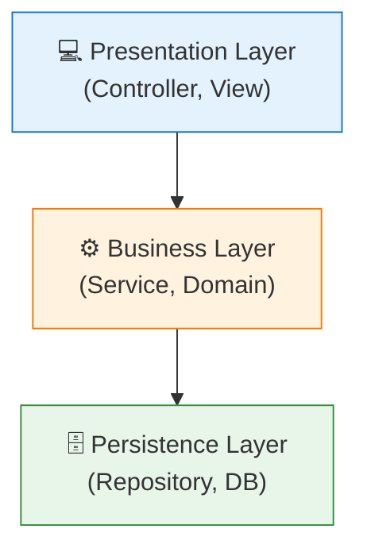
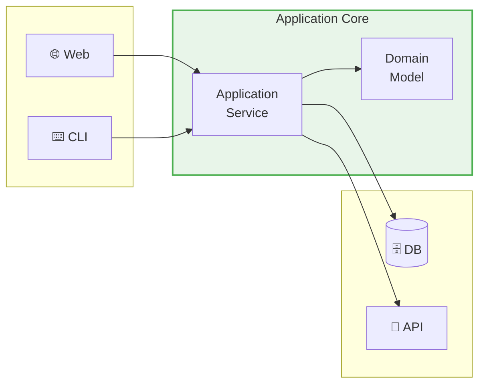
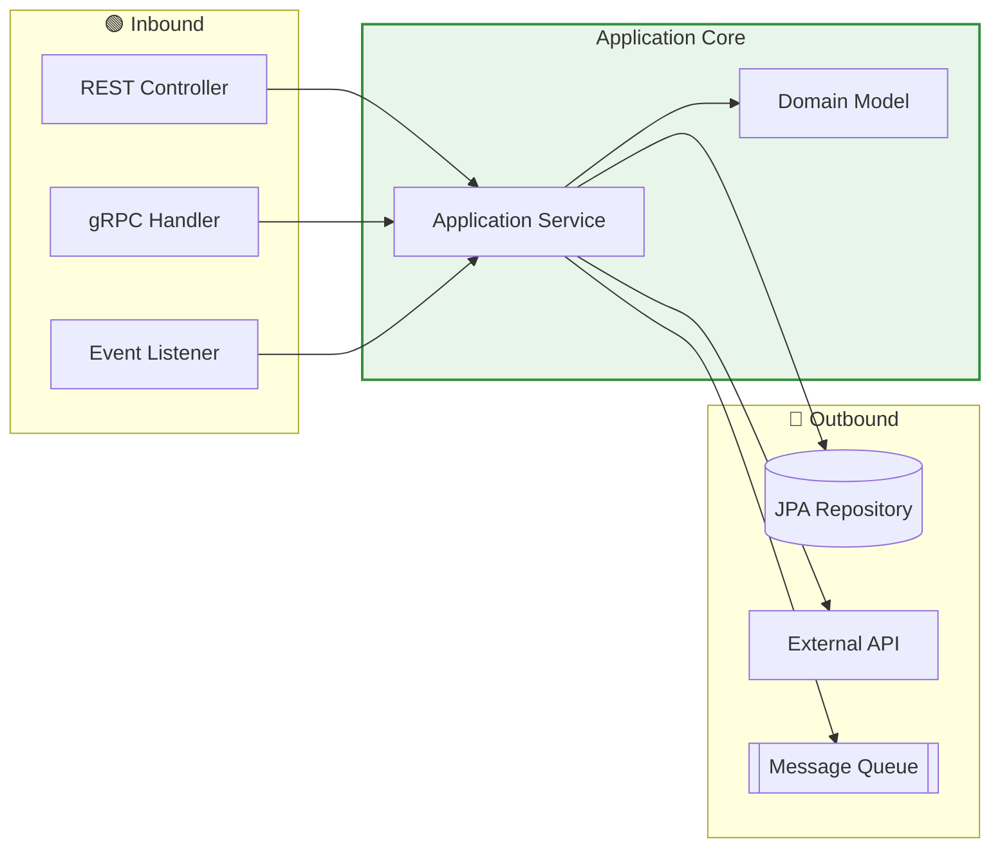
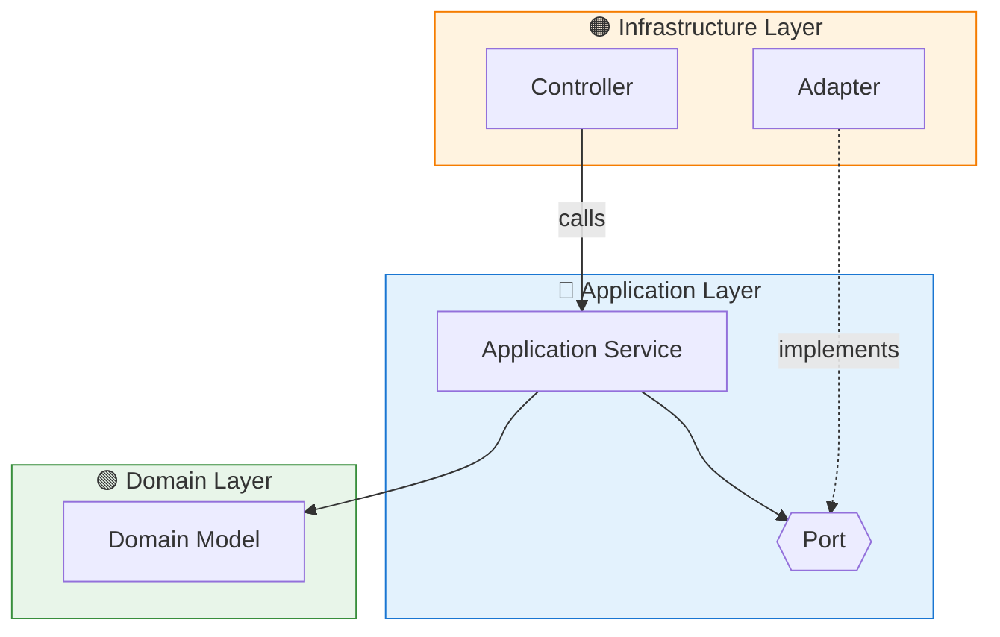
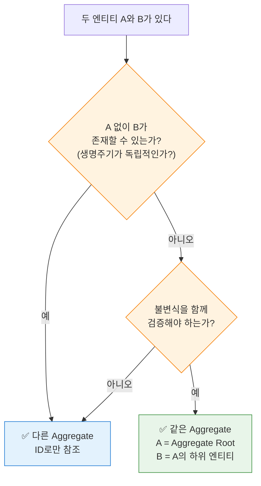
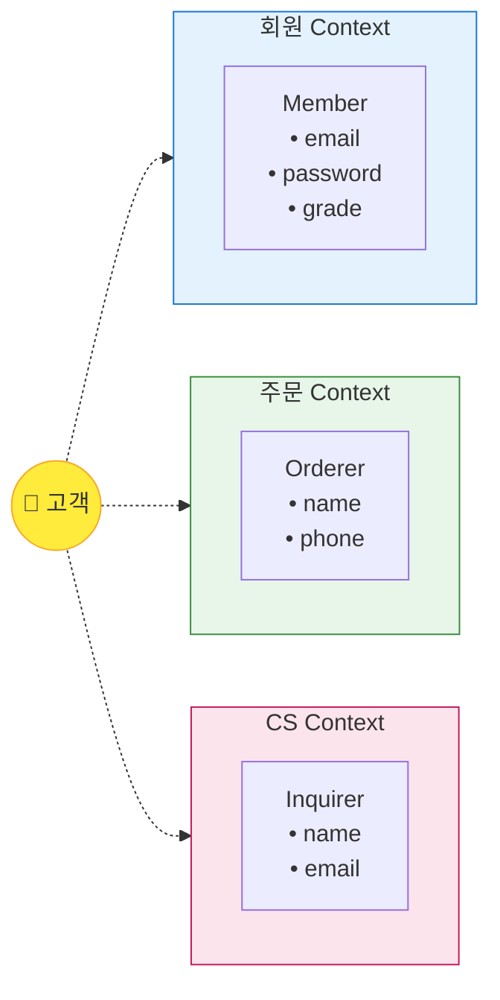

## 목차

1. [개요](#개요)
2. [전통적인 Layered Architecture의 한계](#전통적인-layered-architecture의-한계)
3. [Hexagonal Architecture (Ports & Adapters)](#hexagonal-architecture-ports--adapters)
4. [Domain-Driven Design 핵심 개념](#domain-driven-design-핵심-개념)
5. [Aggregate 설계 원칙](#aggregate-설계-원칙)
6. [Bounded Context와 컨텍스트 간 통합](#bounded-context와-컨텍스트-간-통합)
7. [실전 패키지 구조](#실전-패키지-구조)
8. [요약 및 체크리스트](#요약-및-체크리스트)

---

## 개요

### 왜 아키텍처가 중요한가?

소프트웨어 아키텍처는 시스템의 **변경 용이성** 을 결정합니다. 좋은 아키텍처는:

- 비즈니스 로직을 기술적 결정(프레임워크, DB, 외부 서비스)으로부터 **보호** 합니다
- 각 컴포넌트가 **하나의 책임** 만 가지도록 합니다
- 테스트를 **쉽게** 만듭니다

### DDD + Hexagonal Architecture

**Domain-Driven Design(DDD)** 은 복잡한 비즈니스 도메인을 모델링하는 방법론이고, **Hexagonal Architecture** 는 이 도메인 모델을 외부 세계로부터 보호하는 아키텍처 패턴입니다. 둘은 서로 보완적이며, 함께 사용할 때 가장 큰 효과를 발휘합니다.

---

## 전통적인 Layered Architecture의 한계

### 일반적인 3계층 구조



### 문제점

| 문제 | 설명 |
|------|------|
| **하향 의존성** | 상위 계층이 하위 계층에 의존 → DB 변경 시 비즈니스 로직도 영향 |
| **기술 침투** | JPA Entity가 도메인 객체 역할 → 비즈니스 로직이 기술에 종속 |
| **테스트 어려움** | DB 없이 비즈니스 로직 테스트가 어려움 |
| **기능별 분산** | 하나의 기능이 여러 패키지에 흩어짐 |

```kotlin
// 문제 예시: 도메인 객체가 JPA에 종속
@Entity
class Order(
    @Id @GeneratedValue
    val id: Long,
    
    @OneToMany(cascade = [CascadeType.ALL])  // JPA 기술이 도메인에 침투
    val items: List<OrderItem>
)
```

---

## Hexagonal Architecture (Ports & Adapters)

### 핵심 아이디어

> "애플리케이션 핵심 로직을 외부 세계로부터 **격리**한다"



### 구성 요소

| 구성 요소 | 설명 | 예시 |
|----------|------|------|
| **Domain** | 순수 비즈니스 로직, 외부 의존성 없음 | Entity, Value Object, Domain Service |
| **Application** | 유스케이스 오케스트레이션 | Application Service |
| **Port (인터페이스)** | 외부와의 계약 정의 | `OrderRepository`, `PaymentGateway` |
| **Adapter (구현체)** | Port의 실제 구현 | `JpaOrderRepository`, `TossPaymentAdapter` |

### Inbound vs Outbound



- **Inbound Port**: 애플리케이션이 **제공** 하는 기능 (Use Case)
- **Outbound Port**: 애플리케이션이 **필요로 하는** 기능 (Repository, External Service)

### 코드로 보는 Port & Adapter

```kotlin
// 📌 Outbound Port (인터페이스) - application 계층에 위치
interface OrderRepository {
    fun save(order: Order): Order
    fun findById(id: OrderId): Order?
}

interface PaymentGateway {
    fun process(payment: Payment): PaymentResult
}

// 📌 Adapter (구현체) - infrastructure 계층에 위치
@Repository
class JpaOrderRepository(
    private val jpaRepository: JpaOrderJpaRepository
) : OrderRepository {
    
    override fun save(order: Order): Order {
        val entity = OrderEntity.from(order)
        return jpaRepository.save(entity).toDomain()
    }
    
    override fun findById(id: OrderId): Order? {
        return jpaRepository.findById(id.value)?.toDomain()
    }
}

@Component
class TossPaymentAdapter(
    private val tossClient: TossPaymentClient
) : PaymentGateway {
    
    override fun process(payment: Payment): PaymentResult {
        val response = tossClient.requestPayment(payment.toRequest())
        return response.toResult()
    }
}

// 📌 Application Service - Port에만 의존
@Service
class OrderService(
    private val orderRepository: OrderRepository,  // Port에 의존
    private val paymentGateway: PaymentGateway     // Port에 의존
) {
    fun placeOrder(command: PlaceOrderCommand): OrderId {
        val order = Order.create(command)
        
        val paymentResult = paymentGateway.process(order.payment)
        order.completePayment(paymentResult)
        
        return orderRepository.save(order).id
    }
}
```

### JPA Repository와 Port 분리하기

JPA를 사용할 때 흔히 하는 실수는 Port 인터페이스가 `JpaRepository`를 직접 상속하게 만드는 것입니다:

```kotlin
// ❌ 문제: Port가 JPA에 종속됨
interface OrderRepository : JpaRepository<Order, Long>  // JPA 기술이 도메인에 침투!
```

이렇게 하면 `OrderRepository`가 더 이상 순수한 Port가 아니라, JPA 구현체에 종속된 인터페이스가 됩니다.

#### 올바른 분리 구조

```
application/
└── port/out/
    └── OrderRepository.kt        ← 순수 Port (인터페이스)

infrastructure/
└── persistence/
    ├── OrderJpaRepository.kt     ← Spring Data JPA 인터페이스
    ├── OrderEntity.kt            ← JPA Entity
    └── OrderRepositoryAdapter.kt ← Port 구현체 (Adapter)
```

#### 1. Port (순수 인터페이스)

```kotlin
// application/port/out/OrderRepository.kt
interface OrderRepository {
    fun save(order: Order): Order
    fun findById(id: OrderId): Order?
    fun findByMemberId(memberId: Long): List<Order>
}
// JPA 의존성 없음!
```

#### 2. JPA Entity (Infrastructure)

```kotlin
// infrastructure/persistence/OrderEntity.kt
@Entity
@Table(name = "orders")
class OrderEntity(
    @Id @GeneratedValue(strategy = GenerationType.IDENTITY)
    val id: Long = 0,
    
    @Column(name = "member_id")
    val memberId: Long,
    
    @Enumerated(EnumType.STRING)
    val status: String,
    
    @OneToMany(cascade = [CascadeType.ALL], orphanRemoval = true)
    val items: MutableList<OrderItemEntity> = mutableListOf()
) {
    // Entity → Domain 변환
    fun toDomain(): Order = Order(
        id = OrderId(id),
        memberId = memberId,
        status = OrderStatus.valueOf(status),
        items = items.map { it.toDomain() }.toMutableList()
    )
    
    companion object {
        // Domain → Entity 변환
        fun from(order: Order) = OrderEntity(
            id = order.id.value,
            memberId = order.memberId,
            status = order.status.name,
            items = order.items.map { OrderItemEntity.from(it) }.toMutableList()
        )
    }
}
```

#### 3. Spring Data JPA Repository (내부용)

```kotlin
// infrastructure/persistence/OrderJpaRepository.kt
interface OrderJpaRepository : JpaRepository<OrderEntity, Long> {
    fun findByMemberId(memberId: Long): List<OrderEntity>
}
// 외부에 노출되지 않음
```

#### 4. Adapter (Port 구현체)

```kotlin
// infrastructure/persistence/OrderRepositoryAdapter.kt
@Repository
class OrderRepositoryAdapter(
    private val jpaRepository: OrderJpaRepository
) : OrderRepository {
    
    override fun save(order: Order): Order {
        val entity = OrderEntity.from(order)
        return jpaRepository.save(entity).toDomain()
    }
    
    override fun findById(id: OrderId): Order? {
        return jpaRepository.findById(id.value)
            .map { it.toDomain() }
            .orElse(null)
    }
    
    override fun findByMemberId(memberId: Long): List<Order> {
        return jpaRepository.findByMemberId(memberId)
            .map { it.toDomain() }
    }
}
```

#### 이 패턴의 장점

| 장점 | 설명 |
|------|------|
| **도메인 순수성** | Domain/Application 계층이 JPA로부터 완전히 격리 |
| **테스트 용이성** | Port만 Mocking하면 되므로 단위 테스트가 쉬움 |
| **기술 교체 용이** | JPA → MongoDB 등으로 변경 시 Adapter만 교체 |
| **Entity 분리** | 도메인 모델과 영속성 모델을 독립적으로 진화 가능 |

#### 트레이드오프: 언제 분리해야 하는가?

| 분리 수준 | 적합한 경우 |
|----------|------------|
| **JpaRepository 직접 상속** | 소규모 프로젝트, CRUD 중심, JPA 교체 계획 없음 |
| **Port/Adapter만 분리** | 중규모, 테스트 중요, 기술 교체 가능성 있음 |
| **Entity까지 분리** | 대규모, 복잡한 비즈니스 로직, 도메인 모델 순수성 중요 |

> **권장**: 처음에는 단순하게 시작하고, 복잡도가 증가하면 점진적으로 분리하세요.

### 의존성 방향



> **핵심**: 화살표 방향이 항상 **안쪽(Domain)** 을 향한다

---

## Domain-Driven Design 핵심 개념

### 전술적 패턴 (Tactical Patterns)

#### 1. Entity

**식별자(Identity)** 를 가지며, 생명주기 동안 상태가 변할 수 있는 객체

```kotlin
class Order(
    val id: OrderId,                    // 식별자
    private var status: OrderStatus,
    private val items: MutableList<OrderItem>
) {
    fun cancel() {
        require(status.isCancellable) { "취소할 수 없는 상태입니다" }
        status = OrderStatus.CANCELLED
    }
}
```

#### 2. Value Object

**식별자가 없고**, **불변** 이며, **속성 값의 조합** 으로 동등성을 판단하는 객체

```kotlin
// ✅ Value Object - 불변, equals는 값으로 비교
data class Money(
    val amount: BigDecimal,
    val currency: Currency
) {
    init {
        require(amount >= BigDecimal.ZERO) { "금액은 0 이상이어야 합니다" }
    }
    
    operator fun plus(other: Money): Money {
        require(currency == other.currency) { "통화가 일치해야 합니다" }
        return Money(amount + other.amount, currency)
    }
}

data class Address(
    val city: String,
    val street: String,
    val zipCode: String
)
```

#### 3. Aggregate

**트랜잭션의 일관성 경계**를 정의하는 엔티티와 값 객체의 클러스터

```kotlin
// Order가 Aggregate Root
class Order(
    val id: OrderId,
    private val orderer: Orderer,                     // Value Object
    private val items: MutableList<OrderItem>,        // Entity (하위)
    private var shippingAddress: Address              // Value Object
) {
    // 외부에서는 반드시 Aggregate Root를 통해서만 접근
    fun addItem(product: ProductSnapshot, quantity: Int) {
        val item = OrderItem(
            productId = product.id,
            productName = product.name,
            price = product.price,
            quantity = quantity
        )
        items.add(item)
    }
    
    fun changeShippingAddress(newAddress: Address) {
        require(status.isAddressChangeable) { "배송지 변경이 불가능한 상태입니다" }
        shippingAddress = newAddress
    }
}
```

#### 4. Domain Service

**엔티티에 속하지 않는** 도메인 로직을 담는 서비스

```kotlin
// 할인 계산은 여러 Aggregate에 걸친 로직
@Service
class DiscountCalculator {
    fun calculate(
        order: Order,
        memberGrade: MemberGrade,
        availableCoupons: List<Coupon>
    ): DiscountResult {
        val gradeDiscount = memberGrade.discountRate * order.totalAmount
        val couponDiscount = findBestCoupon(availableCoupons, order)
        return DiscountResult(gradeDiscount + couponDiscount)
    }
}
```

#### 5. Repository

**Aggregate 영속성**을 추상화하는 컬렉션과 유사한 인터페이스

```kotlin
// Aggregate Root만 Repository를 가짐
interface OrderRepository {
    fun save(order: Order): Order
    fun findById(id: OrderId): Order?
    fun findByOrdererId(ordererId: MemberId): List<Order>
}

// ❌ 잘못된 예: 하위 엔티티에 대한 Repository
interface OrderItemRepository  // Aggregate 경계 위반!
```

#### 6. Domain Event

도메인에서 발생한 **중요한 사건**을 나타내는 객체

```kotlin
// 이벤트 정의
data class OrderPlacedEvent(
    val orderId: OrderId,
    val ordererId: MemberId,
    val totalAmount: Money,
    val occurredAt: Instant = Instant.now()
)

// Aggregate에서 이벤트 발행
class Order(...) : AbstractAggregateRoot<Order>() {
    
    fun place(): Order {
        // 비즈니스 로직...
        status = OrderStatus.PLACED
        
        // 도메인 이벤트 등록
        registerEvent(OrderPlacedEvent(id, orderer.memberId, totalAmount))
        
        return this
    }
}
```

---

## Aggregate 설계 원칙

### 원칙 1: 트랜잭션 경계 = Aggregate 경계

```
질문: "이 두 엔티티가 반드시 같은 트랜잭션에서 변경되어야 하는가?"

예 → 같은 Aggregate
아니오 → 다른 Aggregate
```

### 원칙 2: 불변식(Invariant) 보호

같은 비즈니스 규칙(불변식)을 지켜야 하는 엔티티들을 하나의 Aggregate로 묶습니다.

```kotlin
class Order(
    private val items: MutableList<OrderItem>
) {
    // 불변식: 주문 금액은 최소 10,000원 이상이어야 한다
    fun addItem(item: OrderItem) {
        items.add(item)
        require(totalAmount >= Money.of(10_000)) {
            "주문 금액은 최소 10,000원 이상이어야 합니다"
        }
    }
}
```

### 원칙 3: 작게 유지

큰 Aggregate는 **동시성 문제**와 **성능 저하**를 유발합니다.

```kotlin
// ❌ 너무 큰 Aggregate
class Order(
    val items: List<OrderItem>,
    val payments: List<Payment>,      // 별도 Aggregate로 분리
    val shipments: List<Shipment>,    // 별도 Aggregate로 분리
    val reviews: List<Review>         // 별도 Aggregate로 분리
)

// ✅ 적절한 크기
class Order(val items: List<OrderItem>)
class Payment(val orderId: OrderId)    // ID로만 참조
class Shipment(val orderId: OrderId)   // ID로만 참조
```

### 원칙 4: ID로 참조

다른 Aggregate는 **객체 참조가 아닌 ID로** 참조합니다.

```kotlin
// ❌ 잘못된 방식 - 객체 직접 참조
class Order(
    val customer: Customer  // 다른 Aggregate를 직접 참조
)

// ✅ 올바른 방식 - ID로 참조
class Order(
    val customerId: CustomerId  // ID로만 참조
)
```

### 원칙 5: Eventual Consistency

Aggregate 간에는 **도메인 이벤트**를 통해 비동기로 일관성을 유지합니다.

```kotlin
// Order Aggregate
class Order(...) {
    fun place() {
        status = OrderStatus.PLACED
        registerEvent(OrderPlacedEvent(id, totalAmount))
    }
}

// 이벤트 핸들러에서 다른 Aggregate 처리
@EventListener
class InventoryEventHandler(
    private val inventoryService: InventoryService
) {
    @Async
    fun handle(event: OrderPlacedEvent) {
        // 재고 차감은 별도 트랜잭션
        inventoryService.decreaseStock(event.orderId)
    }
}
```

### Aggregate 설계 의사결정 플로우차트



---

## Bounded Context와 컨텍스트 간 통합

### Bounded Context란?

**같은 용어(유비쿼터스 언어)가 같은 의미**를 가지는 경계입니다.

> 실제 세계의 "고객"이라는 개념이 각 Context에서 다른 속성과 행위를 가짐



### 스냅샷 패턴

다른 Context의 데이터는 **필요 시점에 복사**하여 사용합니다.

```kotlin
// 주문 Context
data class Orderer(
    val memberId: Long,     // 원본 참조용 ID
    val name: String,       // 주문 시점의 스냅샷
    val phone: String       // 주문 시점의 스냅샷
)

// 주문 생성 시
class OrderService(
    private val memberQueryPort: MemberQueryPort  // 회원 Context 조회 Port
) {
    fun createOrder(memberId: Long, ...): Order {
        val member = memberQueryPort.findById(memberId)
        
        // 스냅샷 생성 - 이후 원본이 바뀌어도 주문의 주문자 정보는 유지
        val orderer = Orderer(
            memberId = member.id,
            name = member.name,
            phone = member.phone
        )
        
        return Order(orderer = orderer, ...)
    }
}
```

### Context 간 통합 패턴

#### 1. Shared Kernel (공유 커널)

두 Context가 일부 모델을 **공유**합니다. 결합도가 높으므로 신중히 사용해야 합니다.

```kotlin
// 공유 모듈
package shared.model

data class Money(val amount: BigDecimal, val currency: Currency)
data class Address(val city: String, val street: String, val zipCode: String)
```

#### 2. Anti-Corruption Layer (ACL)

외부 Context의 모델을 **내 Context의 언어로 번역**합니다.

```kotlin
// 외부 레거시 시스템의 모델
data class LegacyCustomerDto(
    val custNo: String,
    val custNm: String,
    val telNo: String
)

// ACL - 번역 레이어
@Component
class CustomerTranslator {
    fun translate(legacy: LegacyCustomerDto): Orderer {
        return Orderer(
            memberId = legacy.custNo.toLong(),
            name = legacy.custNm,
            phone = formatPhone(legacy.telNo)
        )
    }
}
```

#### 3. Event-Driven Integration

Context 간에 **도메인 이벤트**로 통신합니다.

```kotlin
// 주문 Context에서 발행
@Service
class OrderService {
    fun placeOrder(command: PlaceOrderCommand) {
        val order = Order.create(command)
        orderRepository.save(order)
        
        // 이벤트 발행 - 재고, 결제, 알림 Context가 구독
        eventPublisher.publish(OrderPlacedEvent(order.id, order.items))
    }
}

// 재고 Context에서 구독
@Service
class InventoryEventHandler {
    @EventListener
    fun on(event: OrderPlacedEvent) {
        event.items.forEach { item ->
            inventoryService.decrease(item.productId, item.quantity)
        }
    }
}
```

---

## 실전 패키지 구조

### 추천 구조: Package by Feature + Hexagonal

```
com.example.order/                     # Bounded Context
├── application/                       # Application Layer
│   ├── port/
│   │   ├── in/                       # Inbound Ports (Use Cases)
│   │   │   ├── PlaceOrderUseCase.kt
│   │   │   └── CancelOrderUseCase.kt
│   │   └── out/                      # Outbound Ports
│   │       ├── OrderRepository.kt
│   │       ├── PaymentGateway.kt
│   │       └── MemberQueryPort.kt
│   ├── service/                      # Application Services
│   │   └── OrderService.kt
│   └── dto/                          # Application DTOs
│       ├── PlaceOrderCommand.kt
│       └── OrderResult.kt
│
├── domain/                           # Domain Layer
│   ├── model/
│   │   ├── Order.kt                 # Aggregate Root
│   │   ├── OrderItem.kt             # Entity
│   │   ├── Orderer.kt               # Value Object
│   │   └── OrderStatus.kt           # Enum/Value Object
│   ├── event/
│   │   └── OrderPlacedEvent.kt
│   └── service/                     # Domain Services
│       └── DiscountPolicy.kt
│
└── infrastructure/                   # Infrastructure Layer
    ├── persistence/
    │   ├── JpaOrderRepository.kt    # Adapter
    │   ├── OrderEntity.kt           # JPA Entity
    │   └── OrderJpaRepository.kt    # Spring Data JPA
    ├── web/
    │   ├── OrderController.kt       # Inbound Adapter
    │   └── OrderRequest.kt          # Web DTO
    └── external/
        └── TossPaymentAdapter.kt    # Outbound Adapter
```

### 의존성 규칙

```kotlin
// ✅ 올바른 의존성 방향
// infrastructure → application → domain

// domain: 외부 의존성 없음
package com.example.order.domain.model

class Order(...)  // 순수 Kotlin, 프레임워크 의존성 없음

// application: domain에만 의존
package com.example.order.application.service

import com.example.order.domain.model.Order
import com.example.order.application.port.out.OrderRepository

@Service
class OrderService(
    private val orderRepository: OrderRepository  // Port (인터페이스)
)

// infrastructure: application과 domain에 의존
package com.example.order.infrastructure.persistence

import com.example.order.application.port.out.OrderRepository
import com.example.order.domain.model.Order

@Repository
class JpaOrderRepository : OrderRepository {  // Adapter (구현체)
    // JPA, Spring 의존성은 여기에만
}
```

---

## 요약 및 체크리스트

### Hexagonal Architecture 체크리스트

- [ ] Domain 계층에 프레임워크 의존성이 없는가?
- [ ] 외부 시스템과의 통신은 Port(인터페이스)로 추상화되어 있는가?
- [ ] Application Service는 Port에만 의존하는가?
- [ ] Adapter는 Infrastructure 계층에 위치하는가?
- [ ] 의존성 방향이 항상 안쪽(Domain)을 향하는가?

### Aggregate 설계 체크리스트

- [ ] Aggregate Root만 Repository를 가지는가?
- [ ] 다른 Aggregate는 ID로만 참조하는가?
- [ ] 하나의 트랜잭션에서 하나의 Aggregate만 수정하는가?
- [ ] Aggregate 크기가 적절한가? (너무 크지 않은가?)
- [ ] 불변식이 Aggregate 내에서 보호되는가?

### Bounded Context 체크리스트

- [ ] 각 Context에서 용어가 명확하게 정의되어 있는가?
- [ ] 다른 Context의 데이터는 스냅샷으로 사용하는가?
- [ ] Context 간 통합은 이벤트 또는 ACL을 통하는가?
- [ ] 공유 커널 사용을 최소화했는가?

### 핵심 원칙 요약

| 원칙 | 설명 |
|------|------|
| **의존성 역전** | 고수준(Domain)이 저수준(Infrastructure)에 의존하지 않음 |
| **단일 책임** | 각 클래스/모듈은 하나의 책임만 가짐 |
| **캡슐화** | Aggregate Root를 통해서만 하위 엔티티에 접근 |
| **ID 참조** | Aggregate 간에는 객체가 아닌 ID로 참조 |
| **Eventual Consistency** | Aggregate 간 일관성은 이벤트로 비동기 처리 |

---

*이 글은 AI의 도움을 받아 교정 및 정리되었습니다.*