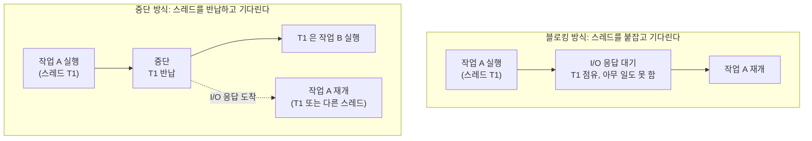
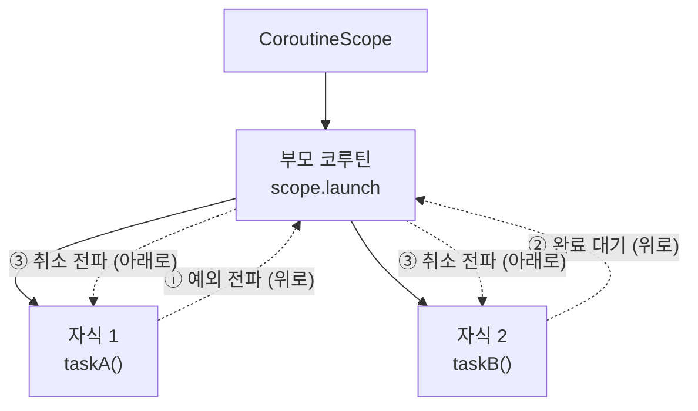
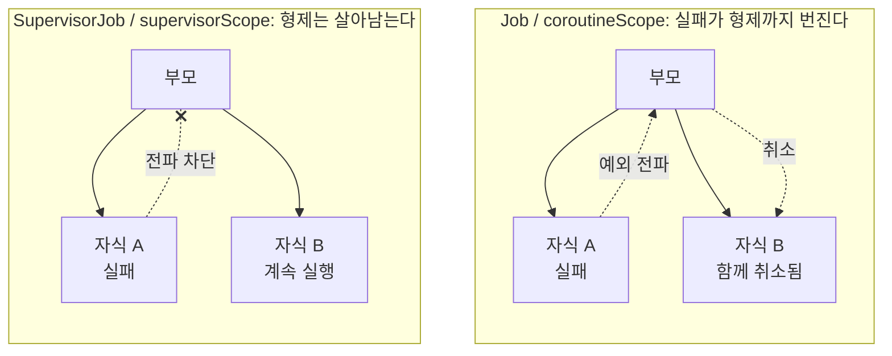
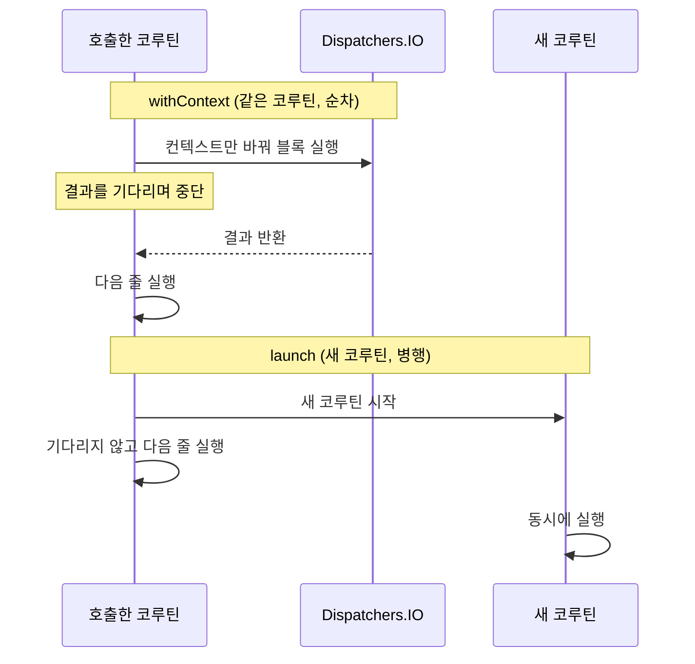

이 문서는 두 부분으로 구성됩니다.

- **1부. 필수 기본 개념**: 코루틴을 사용하기 위해 반드시 알아야 하는 토대. 이후 내용의 전제가 됩니다.
- **2부. 헷갈리기 쉬운 개념**: 1부의 개념 위에서, 실무에서 자주 혼동되고 실수하는 지점들을 비교 중심으로 정리합니다.

---

# 1부. 필수 기본 개념

## 1. 코루틴이란 무엇인가

코루틴(coroutine)은 **중단(suspend)했다가 나중에 재개(resume)할 수 있는 계산 단위**입니다.

스레드와 비교하면 이해가 쉽습니다:

| | 스레드 | 코루틴 |
|---|---|---|
| 생성 비용 | 비쌈 (OS 자원, ~1MB 스택) | 매우 저렴 (일반 객체 수준) |
| 개수 한계 | 수천 개 수준 | 수십만 개도 가능 |
| 기다리는 방식 | 블로킹 (스레드 점유) | 중단 (스레드 반납) |
| 관리 주체 | OS 스케줄러 | 코루틴 라이브러리 + 디스패처 |

핵심 차이는 **기다리는 방식**입니다. 스레드는 I/O 응답을 기다리는 동안 아무것도 못 하면서 자리를 차지합니다. 코루틴은 기다려야 할 때 스레드를 **놓아주고**, 그 스레드는 다른 코루틴을 실행합니다. 응답이 오면 코루틴은 (같은 스레드든 다른 스레드든) 이어서 실행됩니다.



즉, 코루틴은 "적은 수의 스레드 위에서 아주 많은 동시 작업을 굴리는" 기술입니다.

## 2. `suspend` 함수: 중단 가능한 함수

```kotlin
suspend fun loadUser(id: Long): User {
    delay(100)          // 여기서 중단될 수 있음 (스레드는 반납)
    return fetch(id)
}
```

`suspend` 키워드의 의미는 정확히 하나입니다: **"이 함수는 실행 중간에 중단될 수 있으므로, 코루틴 안에서만 호출할 수 있다."**

꼭 기억할 성질 두 가지:

1. **suspend 함수는 순차적으로 실행됩니다.** 호출하면 끝날 때까지 다음 줄로 넘어가지 않습니다. 일반 함수와 읽는 방식이 같습니다. (단지 기다리는 동안 스레드를 블로킹하지 않을 뿐입니다.)
2. **suspend 함수는 suspend 함수 또는 코루틴 안에서만 호출할 수 있습니다.** 일반 함수에서 호출하려면 코루틴을 만들어야 합니다. 코루틴을 만드는 도구가 다음의 "코루틴 빌더"입니다.

## 3. 코루틴 빌더: 코루틴을 만드는 진입점

일반 코드(동기 세계)에서 코루틴(비동기 세계)으로 들어가는 문이 코루틴 빌더입니다. 3가지가 기본입니다.

### `launch`: 결과 없는 작업 실행
```kotlin
scope.launch {
    sendLog(event)      // fire-and-forget
}
```
새 코루틴을 시작하고 **즉시 리턴**합니다. 반환값은 `Job`(코루틴 핸들)이며, 결과값은 없습니다.

### `async`: 결과 있는 작업 실행
```kotlin
val deferred: Deferred<User> = scope.async { loadUser(1) }
val user = deferred.await()    // 결과가 준비될 때까지 중단하며 기다림
```
새 코루틴을 시작하고 `Deferred<T>`(미래의 값)를 반환합니다. `await()`로 결과를 받습니다.

### `runBlocking`: 동기 세계와의 최상위 경계
```kotlin
fun main() = runBlocking {
    loadUser(1)
}
```
**현재 스레드를 블로킹하면서** 코루틴을 실행합니다. `main` 함수나 테스트처럼 "코루틴 세계로 처음 들어가는 지점"에서만 사용합니다. (남용하면 안 되는 이유는 2부 §6에서 다룹니다.)

## 4. `CoroutineContext`: 코루틴의 설정 값 집합

모든 코루틴은 **컨텍스트**를 가지고 실행됩니다. 컨텍스트는 설정 요소들의 집합(Map과 유사)이고, 주요 요소는 4가지입니다:

| 요소 | 역할 |
|---|---|
| `Job` | 코루틴의 생명주기 핸들 (취소, 완료 대기, 부모-자식 관계) |
| `CoroutineDispatcher` | 어떤 스레드(풀)에서 실행할지 |
| `CoroutineName` | 디버깅용 이름 |
| `CoroutineExceptionHandler` | 잡히지 않은 예외의 최후 처리기 |

`+` 연산자로 조합합니다:

```kotlin
launch(Dispatchers.IO + CoroutineName("user-sync")) { ... }
```

자식 코루틴은 부모의 컨텍스트를 **상속**받고, 빌더에 넘긴 인자로 일부를 덮어씁니다. (단, `Job`은 상속이 아니라 "부모의 Job의 자식으로 새 Job이 생성"됩니다. 이 부모-자식 관계가 §6 구조적 동시성의 뼈대입니다.)

## 5. Dispatchers: 코루틴이 실행될 스레드 결정

디스패처는 컨텍스트 요소 중 가장 자주 만지게 되는 것으로, 코루틴을 **어느 스레드 풀에서 실행할지** 정합니다.

| Dispatcher | 용도 | 스레드 수 |
|---|---|---|
| `Dispatchers.Main` | UI 갱신 (Android/Compose/Swing) | 메인 스레드 1개 |
| `Dispatchers.Default` | CPU 연산 (정렬, 파싱, 계산) | CPU 코어 수 |
| `Dispatchers.IO` | 블로킹 I/O (파일, JDBC, 동기 HTTP) | 최대 64개+ (탄력적) |

실행 중간에 디스패처를 바꾸는 도구가 `withContext`입니다:

```kotlin
suspend fun loadAndRender(id: Long) {
    val user = withContext(Dispatchers.IO) { dao.find(id) }  // IO 스레드에서
    render(user)                                             // 원래 컨텍스트로 복귀
}
```

`withContext`는 새 코루틴을 만들지 않고, 블록이 끝날 때까지 기다렸다가 결과를 반환합니다.

## 6. `CoroutineScope`와 구조적 동시성: 코루틴의 생명주기 관리

### CoroutineScope

`launch`와 `async`는 아무 데서나 호출할 수 없고 **`CoroutineScope`** 위에서만 호출할 수 있습니다. 스코프는 "이 코루틴이 어디에 소속되고 언제까지 살 수 있는가"라는 **생명주기 범위**를 나타냅니다.

```kotlin
class UserSyncService {
    private val scope = CoroutineScope(SupervisorJob() + Dispatchers.Default)

    fun start() { scope.launch { syncLoop() } }
    fun shutdown() { scope.cancel() }   // 이 스코프에서 띄운 모든 코루틴 취소
}
```

Android의 `viewModelScope`, `lifecycleScope`도 같은 원리로, 컴포넌트가 죽을 때 스코프를 취소해 줍니다.

### 구조적 동시성 (Structured Concurrency)

코루틴의 가장 중요한 설계 원칙입니다. **모든 코루틴은 부모-자식 트리를 이룹니다:**

- 부모는 **모든 자식이 끝나야** 완료됩니다. (작업이 유실되지 않음)
- 부모가 **취소되면 자식도 전부 취소**됩니다. (유령 작업이 남지 않음)
- 자식에서 예외가 나면 **부모로 전파**됩니다. (실패가 조용히 묻히지 않음)

```kotlin
scope.launch {                 // 부모
    launch { taskA() }         // 자식 1
    launch { taskB() }         // 자식 2
}   // 부모는 A, B가 모두 끝나야 완료. 부모 취소 시 A, B도 취소.
```

이 트리 위에서 세 가지 규칙이 각각 다른 방향으로 흐릅니다.



이 원칙 덕분에 "어딘가에서 돌아가고 있는지 아무도 모르는 코루틴"이 원천적으로 생기지 않습니다. 2부에서 다루는 함정 대부분(GlobalScope, SupervisorJob 위치, 예외 전파)은 이 트리 구조를 이해하면 자연스럽게 설명됩니다.

## 7. 취소는 협력적이다: 기본 동작 원리

`job.cancel()`은 강제 종료가 아니라 **취소 요청**입니다. 코루틴은 **중단 지점(suspension point)에 도달했을 때** 취소를 확인하고 `CancellationException`을 던지며 종료됩니다.

- `delay`, `yield` 등 kotlinx.coroutines의 suspend 함수들은 모두 취소 확인 지점입니다.
- 중단 지점이 없는 코드(순수 CPU 루프, 블로킹 호출)는 취소해도 멈추지 않습니다.
- `CancellationException`은 "오류"가 아니라 **정상적인 취소 신호**입니다. 이 구분이 2부 §10의 함정으로 이어집니다.

---

여기까지가 토대입니다. 요약하면:

> **suspend 함수**(중단 가능한 순차 코드)를 **코루틴 빌더**(launch/async)로 실행하고, 코루틴은 **컨텍스트**(Job + Dispatcher 등)를 가지고 **스코프**(생명주기) 안에서 돌며, 부모-자식 트리로 묶여 **구조적 동시성**(완료 대기·취소·예외 전파)의 보호를 받는다. 취소는 협력적이다.

이제 이 개념들이 서로 얽히면서 생기는 혼동 지점들을 봅니다.

---

# 2부. 헷갈리기 쉬운 개념

## 1. `suspend` ≠ 비동기, `suspend` ≠ 백그라운드 실행

1부 §2에서 봤듯 suspend 함수는 **순차 실행**됩니다. 그런데 "suspend를 붙였으니 비동기/병렬로 돌겠지"라고 오해하는 경우가 가장 많습니다.

```kotlin
suspend fun main2() {
    val a = load()   // 끝날 때까지 기다림
    val b = load()   // a가 끝난 후 실행. 병렬 아님!
}
```

- **병렬 실행**을 원하면 `async`(1부 §3)로 새 코루틴을 만들어야 합니다.
- **스레드 전환**을 원하면 `withContext(Dispatchers.IO)`(1부 §5)를 명시해야 합니다.

**suspend는 "기다릴 수 있음"이지 "동시에 실행됨"이 아닙니다.**

## 2. Blocking vs Suspending

1부 §1의 "기다리는 방식" 차이가 코드 수준에서 나타나는 지점입니다.

| | Blocking (`Thread.sleep`) | Suspending (`delay`) |
|---|---|---|
| 스레드 | 붙잡고 아무것도 못 하게 함 | 반납 (다른 코루틴이 사용) |
| 비용 | 스레드 낭비 | 매우 저렴 |

코루틴 안에서 블로킹 호출(JDBC, `Thread.sleep`, 동기 HTTP 등)을 하면 디스패처의 스레드가 묶여서, 코루틴의 이점이 사라지고 스레드 풀이 고갈될 수 있습니다. 불가피한 블로킹 호출은 블로킹 전용으로 넉넉한 `Dispatchers.IO`로 보내세요:

```kotlin
val rows = withContext(Dispatchers.IO) { jdbcTemplate.query(...) }
```

반대로 Ktor/WebFlux 같은 논블로킹 클라이언트는 이미 suspend라서 `IO`로 감쌀 필요가 없습니다.

## 3. `CoroutineScope` vs `coroutineScope { }` vs `CoroutineContext`

이름이 비슷해 가장 헷갈리는 3형제입니다. 앞의 둘은 1부 §6, §4에서 봤고, 새로 등장하는 것은 소문자 `coroutineScope { }` 함수입니다.

- **`CoroutineScope`** (인터페이스): 코루틴의 생명주기 범위. `launch`/`async`의 호출 대상. (1부 §6)
- **`CoroutineContext`**: Job, Dispatcher 등 설정 값의 집합. (1부 §4)
- **`coroutineScope { }`** (suspend 함수): suspend 함수 안에서 **자식 코루틴들을 묶는 임시 스코프**를 만듭니다. 블록 안의 모든 자식이 끝나야 리턴하고, 자식 하나가 실패하면 전부 취소 후 예외를 전파합니다. 즉, suspend 함수 안에서 구조적 동시성(1부 §6)을 국지적으로 세우는 도구입니다.

```kotlin
suspend fun loadAll() = coroutineScope {
    val a = async { loadA() }
    val b = async { loadB() }
    a.await() + b.await()   // 둘 다 끝나야 리턴, 하나 실패하면 나머지 취소
}
```

**한 줄 요약: Scope는 "어디에 소속되나", Context는 "어떤 설정으로 도나", `coroutineScope {}`는 "자식들 다 끝날 때까지 묶어서 기다리기".**

## 4. `launch` vs `async`: 언제 무엇을

1부 §3의 두 빌더는 용도가 명확히 다릅니다:

| | `launch` | `async` |
|---|---|---|
| 반환 | `Job` | `Deferred<T>` |
| 결과값 | 없음 | `await()`로 받음 |
| 예외 | 발생 즉시 부모로 전파 | `await()` 시점에 던져짐 |

자주 하는 실수:

```kotlin
// ❌ 의미 없는 async: 바로 await하면 병렬성이 없음
val result = async { load() }.await()

// ✅ 순차 실행이면 그냥 suspend 함수 호출 (1부 §2)
val result = load()

// ✅ 병렬이 필요할 때만 async
val a = async { loadA() }
val b = async { loadB() }
process(a.await(), b.await())
```

또한 **결과가 필요 없는데 `async`를 쓰지 마세요.** `await()`를 안 하면 예외를 확인할 기회를 놓칠 수 있습니다. fire-and-forget은 `launch`입니다.

## 5. `Job` vs `SupervisorJob`, `coroutineScope` vs `supervisorScope`

구조적 동시성(1부 §6)에서 "자식 실패는 부모로 전파된다"고 했습니다. 이 전파를 **형제들에게까지 번지게 할지**가 Job과 SupervisorJob의 차이입니다.

- `Job` / `coroutineScope`: 자식 하나가 실패하면 **부모와 나머지 형제 모두 취소**. "전부 성공해야 의미 있는 작업 묶음"에 적합.
- `SupervisorJob` / `supervisorScope`: 자식 하나가 실패해도 **다른 형제는 계속 실행**. "독립적인 작업들의 컨테이너"(서버의 요청들, UI 화면의 위젯들)에 적합.



```kotlin
supervisorScope {
    launch { taskA() }   // 실패해도
    launch { taskB() }   // 얘는 계속 돈다
}
```

흔한 실수:

```kotlin
// ❌ SupervisorJob 효과 없음
launch(SupervisorJob()) { ... }
```

SupervisorJob은 **부모 자리에** 있어야 의미가 있습니다. 자식 빌더의 인자로 넣으면 기존 부모와의 관계만 끊어질 뿐(1부 §4의 Job 상속 규칙 참고), 기대한 supervisor 동작은 일어나지 않습니다. 스코프 생성 시(`CoroutineScope(SupervisorJob() + ...)`) 또는 `supervisorScope { }`로 쓰세요.

## 6. `runBlocking`: 경계에서만

1부 §3에서 runBlocking은 "동기 세계와의 최상위 경계"라고 했습니다. 뒤집으면, **이미 코루틴 세계 안에서는 절대 쓰면 안 됩니다:**

```kotlin
// ❌ suspend 함수/코루틴 안에서 runBlocking 금지
suspend fun bad() {
    runBlocking { ... }   // 스레드 블로킹 → 코루틴의 이점 상실 + 데드락 위험
}
```

특히 `Dispatchers.Main`이나 제한된 스레드 풀에서 호출하면, runBlocking이 점유한 스레드를 내부 코루틴이 기다리는 데드락이 날 수 있습니다. 정당한 사용처는 `main` 함수, 테스트(요즘은 `runTest` 권장), 레거시 동기 API 구현부 정도입니다.

## 7. `GlobalScope`를 피해야 하는 이유

구조적 동시성(1부 §6)의 정확히 반대편에 있는 것이 `GlobalScope`입니다.

- `GlobalScope`의 코루틴은 **어떤 부모에도 묶이지 않고** 애플리케이션 전체 생명주기를 가집니다.
- 화면/요청/컴포넌트가 사라져도 계속 돌아서 **리소스 누수, 유령 작업**이 됩니다.
- 부모가 없으니 취소 전파도, 예외 전파도, 완료 대기도 없습니다. 1부 §6의 보호 장치를 전부 포기하는 셈입니다.

대안: `viewModelScope`, `lifecycleScope`, 또는 생명주기에 맞춰 직접 관리하는 스코프(1부 §6 예시)를 쓰고 종료 시 `scope.cancel()` 하세요.

## 8. `withContext` vs `launch`

1부 §5의 `withContext`와 §3의 `launch`는 겉보기에 비슷하지만 의미가 다릅니다:

- `withContext(ctx) { ... }`: **같은 코루틴**에서 컨텍스트만 바꿔 실행. 끝날 때까지 기다리고 결과를 반환. (순차)
- `launch(ctx) { ... }`: **새 코루틴**을 띄우고 즉시 리턴. (병행)



```kotlin
// 스레드만 바꿔서 순차 실행 → withContext
val user = withContext(Dispatchers.IO) { dao.find(id) }

// 결과 안 기다리는 병행 작업 → launch
scope.launch { logEvent(event) }
```

## 9. `suspend fun CoroutineScope.foo()`: 컨벤션 충돌

IDE 경고 *"Extension functions on CoroutineScope should not be suspending"*의 배경입니다. 1부에서 세운 두 관례가 충돌하기 때문입니다:

- `suspend fun foo()`: "호출한 코루틴 안에서 순차 실행되고 **끝날 때까지 기다린다**" (1부 §2)
- `fun CoroutineScope.foo()`: "이 스코프에 **새 코루틴을 launch하고 즉시 리턴**한다" (launch/async와 같은 패턴, 1부 §3·§6)

둘을 합치면 호출자는 어느 쪽 약속인지 알 수 없으므로 하나만 선택해야 합니다:

```kotlin
// ✅ 끝까지 기다리는 함수 → suspend + 내부 coroutineScope (2부 §3)
suspend fun doWork() = coroutineScope {
    launch { subTask() }
}

// ✅ 띄우고 바로 리턴하는 함수 → CoroutineScope 확장 + Job 반환
fun CoroutineScope.startWork(): Job = launch { ... }

// ❌ 둘을 합친 것 → 경고
suspend fun CoroutineScope.doWork() { ... }
```

일반 타입에 대한 suspend 확장 함수(`suspend fun Repo.find()`)는 전혀 문제 없습니다.

## 10. 취소 관련 함정: 안 멈추는 루프와 삼켜진 취소

1부 §7에서 "취소는 협력적"이라고 했습니다. 여기서 두 가지 함정이 나옵니다.

### 함정 1: 중단 지점이 없으면 취소가 안 된다

```kotlin
// ❌ cancel()해도 안 멈춤: 중단 지점이 없음
while (true) { compute() }

// ✅ 취소 확인을 직접 추가
while (isActive) { compute() }
// 또는
while (true) { ensureActive(); compute() }
```

### 함정 2: `CancellationException`을 삼키면 좀비 코루틴이 된다

취소는 `CancellationException`으로 전달되는데(1부 §7), 이것을 일반 예외처럼 잡아버리면 취소 신호가 사라집니다:

```kotlin
// ❌ 취소 신호까지 먹어버림 → 취소해도 안 죽는 코루틴
try {
    doWork()
} catch (e: Exception) {
    log(e)
}

// ✅ CancellationException은 다시 던지기
try {
    doWork()
} catch (e: CancellationException) {
    throw e
} catch (e: Exception) {
    log(e)
}
```

취소 후 정리 작업이 필요하면 `finally` + `withContext(NonCancellable) { ... }`를 사용하세요.

## 11. 예외 처리: `try-catch`가 안 통하는 곳

구조적 동시성(1부 §6)에서 "자식의 예외는 부모로 전파된다"고 했습니다. 이 때문에 예외 처리 위치가 직관과 다릅니다.

### `launch`: 빌더 바깥의 try-catch로 못 잡는다

```kotlin
// ❌ 못 잡음: 예외는 호출 스택이 아니라 Job 트리를 타고 부모로 전파됨
try {
    scope.launch { throw RuntimeException() }
} catch (e: Exception) { ... }

// ✅ 코루틴 안에서 잡기
scope.launch {
    try { work() } catch (e: Exception) { ... }
}
```

### `async`: `await()` 시점에 던져진다

`await()`을 try-catch로 감싸면 잡히지만, 구조적 동시성 하에서는 부모에게도 전파되므로 "await만 감싸면 안전하다"고 가정하면 안 됩니다. 형제 취소를 원치 않으면 `supervisorScope`(2부 §5)와 조합하세요.

### `CoroutineExceptionHandler`: 복구 수단이 아니다

잡히지 않은 예외가 트리 꼭대기까지 올라왔을 때의 **최후 처리기**(주로 로깅)입니다. 루트 스코프(또는 supervisor 직계 자식)에 설치해야 동작하며, 예외를 "잡아서 복구"하는 용도가 아닙니다.

## 다음 단계: 값이 여러 개라면 Flow

지금까지의 도구는 모두 **값 1개**를 다룹니다. suspend 함수는 값 하나를 반환하고(1부 §2), `async`는 미래의 값 하나(`Deferred<T>`)를 줍니다(1부 §3).

그런데 실시간 이벤트, 페이지 단위 조회, UI 상태 변화처럼 **값이 시간에 걸쳐 여러 번 흘러오는** 경우가 있습니다. 이때 쓰는 것이 같은 라이브러리(`kotlinx.coroutines`)에 들어 있는 **Flow**입니다. Flow를 수집하는 `collect`가 suspend 함수라서 코루틴 안에서만 수집할 수 있고, 컨텍스트·취소·구조적 동시성 등 지금까지 본 규칙을 그대로 물려받습니다.

다만 Flow는 빌더와 연산자, cold/hot 구분, 백프레셔, 예외 투명성처럼 자체 개념 묶음이 따로 필요합니다. 그래서 [Kotlin Flow: 필수 개념부터 헷갈리는 개념까지](/kotlin-flow-confusing-concepts/) 에서 별도로 다룹니다.

---

# 자주 하는 실수 체크리스트

- [ ] `suspend`만 붙이고 병렬 실행될 거라 기대하지 않았는가 (2부 §1)
- [ ] 코루틴 안에서 블로킹 호출을 `Dispatchers.IO` 없이 하지 않았는가 (2부 §2)
- [ ] 결과 필요 없는 곳에 `async`를 쓰거나, `await()` 없는 `async`를 방치하지 않았는가 (2부 §4)
- [ ] `SupervisorJob`을 자식 빌더의 인자로 넣지 않았는가 (2부 §5)
- [ ] suspend 함수 안에서 `runBlocking`을 호출하지 않았는가 (2부 §6)
- [ ] `GlobalScope`를 쓰지 않았는가 (2부 §7)
- [ ] `suspend fun CoroutineScope.foo()` 시그니처를 만들지 않았는가 (2부 §9)
- [ ] `catch (e: Exception)`으로 `CancellationException`을 삼키지 않았는가 (2부 §10)
- [ ] `launch`의 예외를 바깥 `try-catch`로 잡으려 하지 않았는가 (2부 §11)

---

# 참고 자료

- [Kotlin 공식 문서: Coroutines Guide](https://kotlinlang.org/docs/coroutines-guide.html) (기본 개념 전반)
- [Roman Elizarov, *Coroutine Context and Scope*](https://elizarov.medium.com/coroutine-context-and-scope-c8b255d59055) (Scope/Context 구분과 CoroutineScope 확장 컨벤션)
- [Roman Elizarov, *Structured concurrency*](https://elizarov.medium.com/structured-concurrency-722d765aa952) (구조적 동시성과 GlobalScope를 피해야 하는 이유)
- [Android Developers: *Best practices for coroutines in Android*](https://developer.android.com/kotlin/coroutines/coroutines-best-practices) (스코프 관리와 디스패처 주입 등 실무 지침)

---

*이 글은 AI의 도움을 받아 교정 및 정리되었습니다.*
