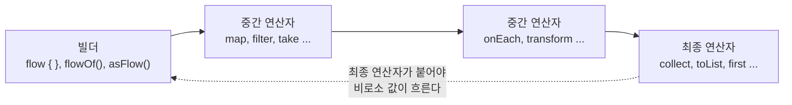
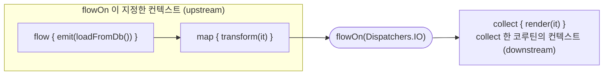
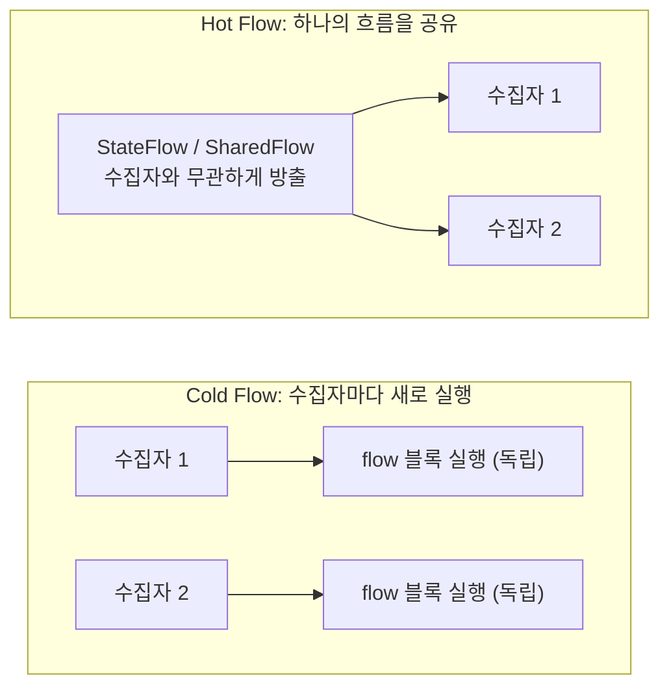
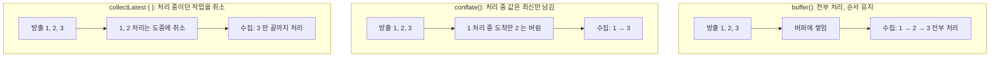
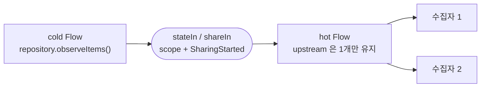

이 글은 [Kotlin 코루틴: 필수 개념부터 헷갈리는 개념까지](/kotlin-coroutines-confusing-concepts/) 의 후속편입니다. 코루틴의 기본 개념(suspend, 코루틴 빌더, 컨텍스트, 스코프, 구조적 동시성, 취소)을 알고 있다고 가정합니다.

구성은 앞 글과 같습니다.

- **1부. 필수 기본 개념**: Flow가 무엇이고 어떻게 도는지. 이후 내용의 전제가 됩니다.
- **2부. 헷갈리기 쉬운 개념**: 1부의 개념 위에서, 실무에서 자주 혼동되고 실수하는 지점들을 비교 중심으로 정리합니다.

---

# 1부. 필수 기본 개념

## 1. Flow란 무엇인가

`Flow<T>`는 **값을 시간에 걸쳐 여러 개 흘려보내는, 중단 가능한 스트림**입니다.

코루틴에서 이미 쓰던 것들과 비교하면 자리가 분명해집니다.

| | 값의 개수 | 언제 나오나 | 기다릴 때 |
|---|---|---|---|
| `suspend fun`: `T` | 1개 | 한 번에 | 중단 (스레드 반납) |
| `List<T>` | 여러 개 | 전부 다 만들어진 뒤 한 번에 | 해당 없음 |
| `Sequence<T>` | 여러 개 | 하나씩 (지연 계산) | 블로킹 |
| `Flow<T>` | 여러 개 | 하나씩 (지연 계산) | 중단 (스레드 반납) |

즉 **Flow는 "여러 개의 값"과 "중단 가능"을 동시에 만족하는 유일한 칸**입니다. 페이지 단위로 내려오는 API 응답, 파일을 줄 단위로 읽기, 서버가 밀어주는 이벤트, 화면 상태의 변화처럼 "값이 끝나지 않고 계속 온다"에 씁니다.

Flow의 구조는 세 부분입니다.



**최종 연산자가 붙기 전까지는 아무 일도 일어나지 않습니다.** 이것이 뒤에 나오는 cold의 의미이자, Flow를 처음 쓸 때 "왜 로그가 안 찍히지"로 가장 많이 부딪히는 지점입니다.

## 2. 만들기: Flow 빌더

```kotlin
// 1. flow { } : 가장 일반적. 블록 안에서 suspend 함수 호출 가능
val pages: Flow<Page> = flow {
    var cursor: String? = null
    do {
        val page = api.load(cursor)   // suspend 함수 호출 OK
        emit(page)                    // 값 방출
        cursor = page.next
    } while (cursor != null)
}

// 2. flowOf() : 고정된 값 몇 개
val f = flowOf(1, 2, 3)

// 3. asFlow() : 이미 있는 컬렉션/시퀀스/범위를 Flow로
val g = listOf("a", "b").asFlow()
```

`emit()`은 suspend 함수입니다. 수집자가 값을 다 처리할 때까지 방출이 중단되는데, 이 성질이 2부 §6의 백프레셔로 이어집니다.

## 3. 흐르게 하기: 최종 연산자

Flow에 값이 흐르기 시작하는 유일한 계기가 **최종 연산자(terminal operator)** 입니다. 전부 suspend 함수라 코루틴 안에서만 호출할 수 있습니다.

```kotlin
scope.launch {
    pages.collect { page -> render(page) }   // 가장 기본. 끝날 때까지 중단
}

val all = pages.toList()      // 전부 모아서 List 로
val head = pages.first()      // 첫 값만 받고 나머지는 취소
val sum = numbers.reduce { a, b -> a + b }
```

`collect`는 **Flow가 끝날 때까지 리턴하지 않습니다.** 끝이 없는 Flow(이벤트 스트림 등)를 `collect`하면 그 자리에서 계속 머무릅니다. 뒤 코드를 이어서 돌리고 싶다면 별도 코루틴에서 수집해야 합니다.

```kotlin
// 위 launch 패턴의 축약형: onEach + launchIn
events.onEach { handle(it) }.launchIn(scope)   // 새 코루틴에서 수집, 즉시 리턴
```

## 4. 가공하기: 중간 연산자

중간 연산자는 **Flow를 받아 Flow를 돌려주는 함수**입니다. 최종 연산자가 아니므로 **호출해도 아무것도 실행되지 않고**, 파이프라인 모양만 바뀝니다.

```kotlin
pages
    .map { it.items }            // 변환
    .filter { it.isNotEmpty() }  // 걸러내기
    .take(3)                     // 3개만 받고 upstream 취소
    .onEach { log(it) }          // 값을 지나가며 부수효과
    .collect { render(it) }      // 여기서 비로소 실행
```

중간 연산자 자체는 suspend 함수가 아니지만, **람다 블록 안에서는 suspend 함수를 호출할 수 있습니다.** `map { api.enrich(it) }` 같은 코드가 자연스럽게 되는 이유입니다.

## 5. 컨텍스트: 컨텍스트 보존과 `flowOn`

Flow에는 **컨텍스트 보존(context preservation)** 이라는 규칙이 있습니다. **`emit`은 `collect`를 호출한 코루틴의 컨텍스트에서 일어나야 합니다.** 그래서 빌더 안에서 직접 컨텍스트를 바꾸면 예외가 납니다.

```kotlin
// ❌ IllegalStateException: Flow invariant is violated
flow {
    withContext(Dispatchers.IO) { emit(dao.findAll()) }
}

// ✅ 컨텍스트 변경은 flowOn 으로 선언한다
flow { emit(dao.findAll()) }
    .flowOn(Dispatchers.IO)
```

`flowOn`은 **자기 위쪽(upstream)** 의 컨텍스트만 바꿉니다. 아래쪽(downstream)과 `collect`는 수집한 코루틴의 컨텍스트를 그대로 씁니다.

```kotlin
flow { emit(loadFromDb()) }      // ← Dispatchers.IO 에서 실행
    .map { transform(it) }        // ← Dispatchers.IO 에서 실행
    .flowOn(Dispatchers.IO)
    .collect { render(it) }       // ← collect 한 코루틴의 컨텍스트에서 실행
```



이 규칙 덕분에 **수집하는 쪽이 자기 스레드를 예측할 수 있습니다.** UI 코드에서 `collect` 블록이 항상 메인 스레드에서 돈다고 믿을 수 있는 것이 이 보장 때문입니다.

## 6. 예외와 취소

### 예외 투명성 (exception transparency)

Flow의 규칙은 "**upstream의 예외는 `catch` 연산자로 잡고, downstream(수집 블록)의 예외는 수집하는 쪽에서 잡는다**"입니다.

```kotlin
pages
    .catch { e -> emit(Page.empty()) }   // upstream(빌더·중간 연산자)의 예외만 잡힌다
    .collect { render(it) }              // 여기서 난 예외는 catch 로 안 잡힘
```

`catch`는 **자기 위쪽에서 발생한 예외만** 처리합니다. 위 코드에서 `render()`가 던진 예외는 `catch`를 거치지 않고 `collect` 호출부로 올라갑니다. 순서를 바꿔 `.collect { }.catch { }` 처럼 쓸 수도 없습니다(`collect`는 최종 연산자라 뒤에 연산자를 붙일 수 없습니다).

### 완료 처리

```kotlin
pages
    .onCompletion { cause -> log("끝. 원인=$cause") }  // 정상 종료·예외·취소 모두
    .collect { render(it) }
```

### 취소

Flow는 취소를 **수집하는 코루틴에서 물려받습니다.** 수집 코루틴이 취소되면 Flow도 함께 멈추므로, Flow에 별도의 취소 API가 필요 없습니다.

```kotlin
val job = scope.launch { events.collect { handle(it) } }
job.cancel()   // 수집이 멈추고 upstream 도 정리된다
```

단, 코루틴 취소가 협력적인 것과 마찬가지로 **중단 지점이 있어야 취소가 확인됩니다.** `flow { }` 빌더는 `emit`마다 취소를 확인해 주지만, `flowOf(...)` 같은 일부 빌더는 그렇지 않아 필요하면 `.cancellable()`을 붙입니다.

---

여기까지가 토대입니다. 요약하면:

> **Flow는 값 여러 개를 중단 가능하게 흘려보내는 스트림**이다. 빌더로 만들고 중간 연산자로 모양을 잡되, **최종 연산자를 붙이기 전에는 실행되지 않는다.** 컨텍스트는 `flowOn`으로만 바꾸고, 예외는 `catch`가 위쪽 것만 잡으며, 취소는 수집하는 코루틴에서 물려받는다.

이제 이 개념들이 실제 코드에서 부딪히는 혼동 지점을 봅니다.

---

# 2부. 헷갈리기 쉬운 개념

## 1. Flow vs Sequence vs 그냥 List

셋 다 "값 여러 개"라서 어느 것을 쓸지 헷갈립니다. 기준은 **중간에 중단(suspend)이 필요한가**입니다.

- **`List`**: 데이터가 이미 메모리에 다 있고, 개수가 적을 때. 가장 단순한 것이 가장 좋습니다.
- **`Sequence`**: 값이 많아 지연 계산이 필요하지만 **동기 계산만** 할 때. 안에서 suspend 함수를 호출할 수 없고, 기다리면 스레드를 블로킹합니다.
- **`Flow`**: 값 생산에 **I/O나 대기가 끼어들 때**. `Sequence`에 코루틴을 더한 것으로 이해하면 편합니다.

```kotlin
// ❌ Sequence 안에서는 suspend 호출 불가 (컴파일 에러)
sequence { yield(api.load()) }

// ✅ Flow 는 가능
flow { emit(api.load()) }
```

## 2. "Flow를 만들었는데 아무 일도 안 일어나요"

1부 §1·§3에서 본 cold의 직접적인 결과입니다.

```kotlin
// ❌ 아무것도 실행되지 않음. 파이프라인 '설계도'만 만든 것
fun sync(): Flow<Item> = flow { ... }.onEach { save(it) }
sync()   // 호출해도 save 는 한 번도 안 불린다

// ✅ 최종 연산자가 있어야 흐른다
sync().collect()
// 또는
sync().launchIn(scope)
```

함수가 `Flow`를 반환하면 "이 함수는 실행하지 않고 **레시피만 돌려준다**"는 뜻입니다. 반대로 함수 이름이 동작처럼 생겼는데 `Flow`를 반환한다면(`sync()`, `refresh()` 등) 호출자가 오해하기 쉬우니, 실행까지 책임질 함수는 `suspend fun`으로 만드는 편이 낫습니다.

## 3. Cold vs Hot

- **Cold Flow** (`flow { }`, `flowOf`, `asFlow`): 수집할 때마다 **처음부터 새로 실행**됩니다. 수집자마다 독립적이고, 수집자가 없으면 아무 일도 일어나지 않습니다.
- **Hot Flow** (`StateFlow`, `SharedFlow`): 수집자와 무관하게 값을 유지하거나 방출합니다. 여러 수집자가 **같은 흐름을 공유**하고, 수집을 늦게 시작하면 그 전에 지나간 값은 (replay 설정이 없는 한) 못 받습니다.



실무에서 자주 나는 사고는 **cold Flow를 여러 곳에서 수집하는 것**입니다. 화면 세 곳에서 같은 `api.load()` Flow를 수집하면 API가 세 번 호출됩니다. 공유가 필요하면 §7의 `shareIn`/`stateIn`으로 hot으로 바꿔야 합니다.

## 4. `StateFlow` vs `SharedFlow`

둘 다 hot이지만 성격이 다릅니다.

| | `StateFlow` | `SharedFlow` |
|---|---|---|
| 초기값 | 필수 | 없음 |
| 최신값 보관 | 항상 1개 (`.value`로 즉시 읽기) | `replay` 설정만큼 |
| 같은 값 연속 방출 | 무시됨 (`distinctUntilChanged` 내장) | 모두 방출 |
| 성격 | 상태 (state) | 이벤트 (event) |
| 용도 | UI 상태, 현재 설정값 | 토스트, 네비게이션, 알림 |

여기서 나오는 함정 두 가지입니다.

**함정 1: 일회성 이벤트를 `StateFlow`에 담기.** `StateFlow`는 최신값을 계속 들고 있으므로, 새 수집자가 붙으면(화면 회전, 재구독) **지난 이벤트가 다시 발사**됩니다. 토스트가 한 번 더 뜨는 버그가 이것입니다. 이벤트는 `SharedFlow(replay = 0)`나 `Channel`을 쓰세요.

**함정 2: 같은 값을 다시 넣었는데 수집이 안 됨.** `StateFlow`는 `equals`가 같은 값을 무시합니다.

```kotlin
state.value = Loading   // 방출됨
state.value = Loading   // 무시됨. 수집자에게 안 감
```

`data class`의 필드를 바꿔가며 넣는데 반응이 없다면, 내용이 실제로 달라졌는지(가변 객체를 그 자리에서 수정하고 다시 넣지는 않았는지) 확인해야 합니다. 여러 필드를 동시에 안전하게 바꾸려면 `update { }`를 쓰세요.

```kotlin
_state.update { it.copy(loading = false, items = items) }
```

## 5. 값이 유실되는 것처럼 보일 때: conflation

§4의 "같은 값 무시"와 별개로, `StateFlow`는 **중간 값을 건너뛸 수 있습니다.** 수집자가 느리면 그 사이에 지나간 값은 버려지고 최신값만 전달됩니다(conflation). 상태를 표현하는 데는 문제가 없지만, **모든 값을 빠짐없이 받아야 하는 용도에는 맞지 않습니다.** 그런 경우는 `SharedFlow`(버퍼 설정)나 `Channel`을 쓰세요.

## 6. `buffer` vs `conflate` vs `collectLatest`

1부 §2에서 `emit`이 suspend 함수라고 했습니다. 즉 **수집이 느리면 방출도 느려집니다.** 이 결합을 끊는 도구가 셋인데, 셋 다 "느린 수집자" 문제를 다루지만 결과가 다릅니다.

| 연산자 | 방출과 수집의 관계 | 값 유실 | 언제 |
|---|---|---|---|
| (기본) | 수집이 끝나야 다음 방출 | 없음 | 순서와 완결성이 중요할 때 |
| `buffer()` | 방출은 계속, 수집은 큐에서 처리 | 없음 (버퍼가 넘치기 전까지) | 둘 다 느리지만 전부 처리해야 할 때 |
| `conflate()` | 방출은 계속, 처리 중 들어온 값은 **최신값만 남김** | 있음 | 중간 값이 의미 없을 때 (진행률 등) |
| `collectLatest { }` | 새 값이 오면 **처리 중이던 블록을 취소** | 처리 결과가 유실 | 최신 것만 유효할 때 (검색어 자동완성) |



`conflate`는 **이미 시작한 처리는 끝까지 하고 대기 중인 값을 버리는** 반면, `collectLatest`는 **처리 중인 작업 자체를 취소**합니다. 검색어가 바뀌면 이전 검색 요청을 취소해야 하는 상황이라면 `collectLatest`입니다.

## 7. `stateIn` / `shareIn`과 `SharingStarted`

§3에서 본 "cold Flow를 여러 곳에서 수집하면 여러 번 실행된다"의 해법입니다. cold Flow를 hot으로 바꿔 **하나의 upstream을 공유**합니다.

```kotlin
val items: StateFlow<List<Item>> = repository.observeItems()   // cold
    .stateIn(
        scope = viewModelScope,
        started = SharingStarted.WhileSubscribed(5_000),
        initialValue = emptyList(),
    )
```



`SharingStarted`가 "**upstream을 언제 켜고 끌지**"를 정합니다.

- `Eagerly`: 스코프가 살아 있는 동안 계속. 수집자가 없어도 계속 돕니다.
- `Lazily`: 첫 수집자가 붙을 때 시작하고, 이후로는 계속.
- `WhileSubscribed(stopTimeoutMillis)`: 수집자가 있을 때만 돌고, 마지막 수집자가 떠나고 지정 시간이 지나면 중단.

`WhileSubscribed(5_000)`이 관용구처럼 쓰이는 이유는 **화면 회전 같은 짧은 재구독 구간에서 upstream을 껐다 켜지 않기 위해서**입니다. 5초 안에 새 수집자가 붙으면 그대로 이어집니다. 반대로 `Eagerly`를 쓰면 화면이 보이지 않는 동안에도 API 폴링이 계속 돌 수 있습니다.

## 8. `flatMapConcat` vs `flatMapMerge` vs `flatMapLatest`

"값마다 또 다른 Flow를 만들어 이어 붙일 때" 쓰는 3형제입니다. §6의 셋과 비슷한 구도지만, 이쪽은 **안쪽 Flow를 어떻게 합치느냐**의 차이입니다.

| 연산자 | 동작 | 순서 | 언제 |
|---|---|---|---|
| `flatMapConcat` | 앞의 안쪽 Flow가 끝나야 다음 시작 | 보장 | 순서가 중요할 때 |
| `flatMapMerge` | 여러 안쪽 Flow를 동시에 실행 | 보장 안 됨 | 처리량이 중요할 때 |
| `flatMapLatest` | 새 값이 오면 이전 안쪽 Flow를 취소 | 최신 것만 | 검색·필터처럼 최신 입력만 유효할 때 |

```kotlin
// 검색어가 바뀌면 이전 요청은 취소하고 최신 검색어로만 조회
queryFlow
    .debounce(300)
    .flatMapLatest { query -> repository.search(query) }
    .collect { render(it) }
```

## 9. `collect` vs `launchIn`

```kotlin
// A: 이 자리에서 Flow 가 끝날 때까지 중단
events.collect { handle(it) }

// B: 새 코루틴에서 수집하고 즉시 리턴 (Job 반환)
events.onEach { handle(it) }.launchIn(scope)
```

`launchIn(scope)`는 `scope.launch { events.collect { ... } }`의 축약일 뿐입니다. 코루틴 글의 `withContext` vs `launch`(2부 §8)와 같은 구도로, **"기다리는가, 띄우는가"** 의 차이입니다. `launchIn`은 수집 블록을 인자로 받지 않으므로, 처리 로직은 그 앞의 `onEach`에 둡니다.

주의할 점은 `launchIn`이 만든 코루틴도 **스코프의 생명주기를 따른다**는 것입니다. 스코프가 취소되면 수집도 멈춥니다. 코루틴 글에서 본 구조적 동시성(1부 §6)이 그대로 적용됩니다.

## 10. 예외를 `try-catch`로 감싸는 습관

1부 §6의 예외 투명성을 어기는 가장 흔한 형태입니다.

```kotlin
// ❌ 빌더 안에서 downstream 예외까지 삼킴
flow {
    try {
        emit(api.load())     // 수집 블록에서 난 예외까지 여기로 올라와 잡힌다
    } catch (e: Exception) {
        emit(fallback)
    }
}

// ✅ upstream 예외는 catch 연산자로
flow { emit(api.load()) }
    .catch { e -> emit(fallback) }
    .collect { render(it) }
```

위쪽 코드가 위험한 이유는, `render()`가 던진 예외까지 `emit` 호출을 타고 올라와 잡히기 때문입니다. 수집 쪽 버그가 "API 실패"로 둔갑해 조용히 fallback이 나가고, 원인을 찾기 어려워집니다.

같은 이유로 **`CancellationException`을 삼키지 않도록** 주의해야 합니다(코루틴 글 2부 §10). `catch` 연산자는 취소 예외를 다시 던져 주므로 안전하지만, 직접 `catch (e: Exception)`을 쓰면 취소 신호까지 먹습니다.

---

# 자주 하는 실수 체크리스트

- [ ] Flow를 만들어 놓고 최종 연산자를 붙이지 않았는가 (2부 §2)
- [ ] 같은 cold Flow를 여러 곳에서 수집해 upstream이 중복 실행되고 있지 않은가 (2부 §3, §7)
- [ ] 일회성 이벤트를 `StateFlow`에 담지 않았는가 (2부 §4)
- [ ] 모든 값이 필요한 곳에 conflate되는 `StateFlow`를 쓰지 않았는가 (2부 §5)
- [ ] 느린 수집자 문제에 `buffer`/`conflate`/`collectLatest` 중 맞는 것을 골랐는가 (2부 §6)
- [ ] `SharingStarted.Eagerly`로 보이지 않는 화면에서도 upstream을 돌리고 있지 않은가 (2부 §7)
- [ ] 최신 입력만 유효한 곳에 `flatMapConcat`을 쓰지 않았는가 (2부 §8)
- [ ] 빌더 안 `try-catch`로 downstream 예외까지 삼키지 않았는가 (2부 §10)
- [ ] `emit`을 `withContext` 안에서 호출하지 않았는가 (1부 §5)

---

# 참고 자료

- [Kotlin 공식 문서: Asynchronous Flow](https://kotlinlang.org/docs/flow.html) (빌더, 연산자, 컨텍스트, 예외 처리 전반)
- [Android Developers: StateFlow and SharedFlow](https://developer.android.com/kotlin/flow/stateflow-and-sharedflow) (hot Flow의 동작과 설정)
- [kotlinx.coroutines API 레퍼런스: `StateFlow`](https://kotlinlang.org/api/kotlinx.coroutines/kotlinx-coroutines-core/kotlinx.coroutines.flow/-state-flow/), [`SharedFlow`](https://kotlinlang.org/api/kotlinx.coroutines/kotlinx-coroutines-core/kotlinx.coroutines.flow/-shared-flow/) (conflation, replay 등 정확한 계약)
- [Roman Elizarov, *Cold flows, hot channels*](https://elizarov.medium.com/cold-flows-hot-channels-d74769805f9) (cold와 hot의 구분이 필요한 이유)
- [Roman Elizarov, *Execution context of Kotlin Flows*](https://elizarov.medium.com/execution-context-of-kotlin-flows-b8c151c9309b) (컨텍스트 보존과 `flowOn`)
- [Manuel Vivo, *Things to know about Flow's shareIn and stateIn operators*](https://medium.com/androiddevelopers/things-to-know-about-flows-sharein-and-statein-operators-20e6ccb2bc74) (`SharingStarted` 선택 기준)

---

*이 글은 AI의 도움을 받아 교정 및 정리되었습니다.*
