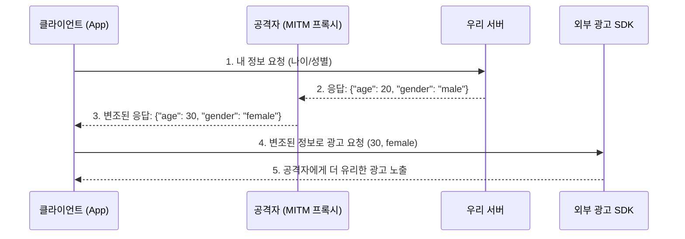
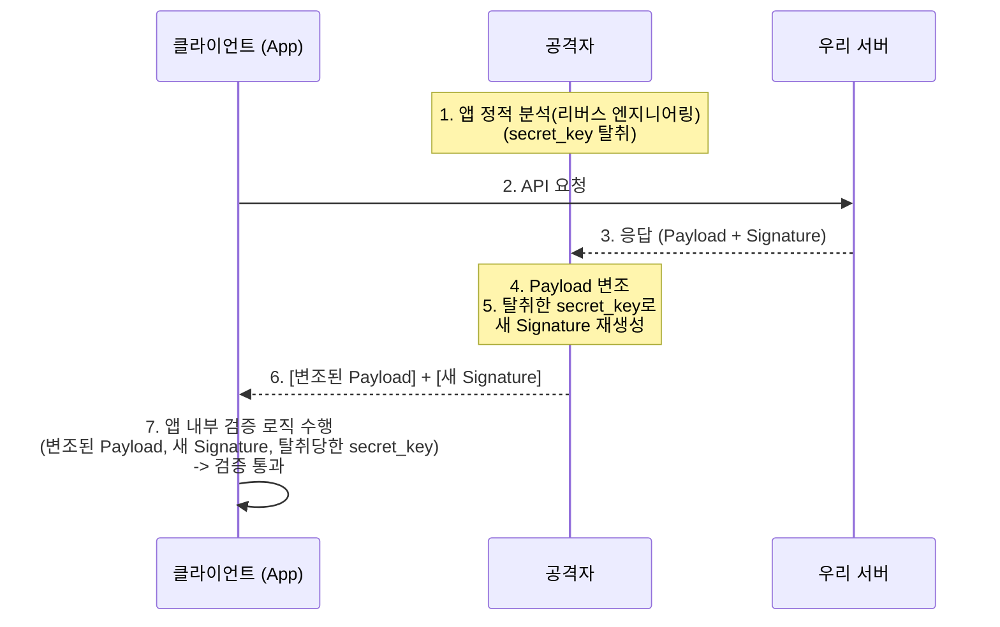
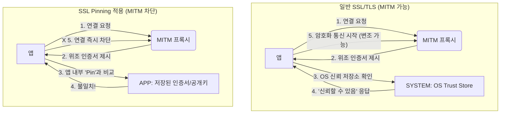
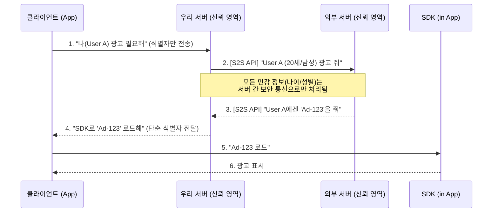

## 들어가며: 신뢰할 수 없는 클라이언트

클라이언트 개발은 본질적으로 '신뢰할 수 없는 실행 환경'을 전제로 합니다. 서버는 우리가 완벽하게 통제할 수 있지만, 사용자의 디바이스에서 실행되는 애플리케이션은 언제든 분석과 변조의 대상이 될 수 있기 때문입니다.

이 글에서는 클라이언트 API 통신에서 발생하는 **중간자(MITM, Man-in-the-Middle) 공격** 을 중심으로, 이를 방어하기 위해 흔히 사용되는 Signature 검증과 SSL Pinning의 명확한 한계를 분석합니다. 그리고 왜 민감한 로직을 서버 간 통신(S2S)으로 이전하는 것이 가장 근본적인 해결책인지 아키텍처 관점에서 고찰해 보겠습니다.

---

## 1. 문제 정의: 중간자(MITM) 공격 시나리오

사용자의 나이/성별 정보를 기반으로 외부 광고 SDK에 타겟팅 정보를 전달하는 앱이 있다고 가정해 보겠습니다.

-   **포인트 적립 (안전한 로직):** 광고 시청 완료 시, [외부 서버] → [우리 서버]로 **S2S(Server-to-Server) + HMAC 검증** 을 통해 포인트가 적립됩니다. 이 로직은 서버 간 통신이므로 안전합니다.
-   **광고 타겟팅 (취약한 로직):**
    1.  `[앱]` → `[우리 서버]` : "내 정보(나이/성별) 요청"
    2.  `[우리 서버]` → `[앱]` : `{"age": 20, "gender": "male"}`
    3.  `[앱]` → `[외부 SDK]` : `(20, male)` 정보를 전달하여 광고 로드

여기서 치명적인 보안 허점이 발생합니다. 공격자가 프록시 툴(Charles, Fiddler 등)을 이용한 **중간자(MITM) 공격** 으로 2번 단계의 API 응답을 가로채 변조할 수 있습니다.

공격자가 더 많은 광고 수익이 할당되는 `(30, female)`로 응답을 조작하면, 서버 로직과는 무관하게 클라이언트 단에서 비즈니스 로직이 왜곡되고, 이는 곧 회사의 손실로 이어질 수 있습니다.

---

## 2. 시도 1: 응답 서명(Signature) 검증의 한계

이 문제의 첫 번째 해결책으로 '응답 서명'을 도입할 수 있습니다.

-   `[서버]` : `payload`와 `secret_key`를 조합해 `signature`를 생성하고, 이를 응답에 포함시킵니다.
-   `[앱]` : 응답을 받으면, 앱 내부에 저장된 동일한 `secret_key`로 `payload`를 검증하여 서명이 일치하는지 확인합니다.

#### 왜 이 방법이 실패하는가?

**검증의 주체인 '클라이언트' 자체를 신뢰할 수 없기 때문**입니다. 공격자는 다음과 같은 순서로 검증 로직을 무력화합니다.

1.  **키 탈취:** 공격자는 앱을 디컴파일하는 등 정적 분석을 통해 앱 내부에 하드코딩된 `secret_key`를 손쉽게 탈취합니다.
2.  **서명 재발급:** MITM 공격으로 `payload`를 변조한 뒤, 탈취한 `secret_key`로 변조된 페이로드에 맞는 **새로운 서명(Signature)을 직접 생성** 합니다.
3.  **검증 통과:** 앱은 `[변조된 payload]`와 `[새롭게 생성된 유효한 서명]`을 수신하므로, 내부 검증 로직을 정상적으로 통과시킵니다.

코드 난독화(Obfuscation)를 통해 키 탈취 난이도를 높일 수는 있으나, 이는 공격 시간을 지연시킬 뿐 근본적인 방어책이 될 수 없습니다.

---

## 3. 시도 2: SSL/TLS Pinning을 통한 MITM 차단

Signature 검증이 실패하는 근본 원인은 'MITM 공격'이 성공했기 때문입니다. SSL/TLS Pinning(이하 SSL Pinning)은 이 MITM 자체를 원천적으로 차단하는 강력한 기술입니다.

-   **작동 원리:** 일반적인 HTTPS 통신은 OS의 신뢰 저장소(Trust Store)에 등록된 공인 CA 인증서라면 모두 신뢰합니다. SSL Pinning은 이를 거부하고, **앱 내부에 미리 하드코딩한 '특정 서버의 인증서(혹은 공개 키)'** 가 아니면 모든 통신을 즉시 차단합니다.
-   **효과:** 공격자가 MITM 프록시 툴로 제시하는 위조된 인증서는 앱이 기대하는 '바로 그' 인증서가 아니므로, 앱은 즉시 통신을 거부합니다. 결과적으로 공격자는 **API 응답 자체를 열람하거나 변조할 수 없습니다.**

#### SSL Pinning의 한계: 루팅(Rooting) 환경

하지만 SSL Pinning 역시 완벽하지 않습니다. 공격자가 기기를 **루팅(Rooting) 또는 탈옥(Jailbreaking)** 하여 시스템 최고 관리자 권한을 획득한 경우, 이 방어책 역시 우회될 수 있습니다.

-   **공격 방식 (동적 분석):** 공격자는 Frida와 같은 동적 분석 도구를 사용해, 실행 중인 앱의 메모리에 접근합니다.
-   **로직 무력화:** 앱이 "이 인증서가 내가 저장한 Pin과 일치하는가?"라고 묻는 **검증 함수 자체를 후킹(Hooking)** 하여, 결과값을 강제로 `true` (성공)로 조작합니다.

결국 SSL Pinning 로직 또한 클라이언트 코드의 일부이며, 기기 제어권을 가진 공격자에게는 분석 및 무력화의 대상이 됩니다.

---

## 4. 클라이언트 보안의 본질: 완벽한 방어는 없다

앞선 사례들은 클라이언트 사이드 보안의 명확한 한계를 보여줍니다. **클라이언트, 즉 사용자의 기기에서 실행되는 모든 코드는 원칙적으로 분석, 변조, 우회가 가능합니다.**

따라서 클라이언트 보안의 목표는 '완벽한 방어'가 될 수 없습니다. 현실적인 목표는 **공격 허들(Hurdle)을 높여, 해킹에 드는 비용과 시간을 공격으로 얻는 이익보다 크게 만드는 것** 입니다.

이 관점에서 두 방식을 재평가할 수 있습니다.

-   **Signature 검증:** **낮은 허들.**
    -   우회 비용: **낮음**. (정적 분석 및 리버스 엔지니어링 기술만으로 우회 가능)
-   **SSL Pinning:** **매우 높은 허들.**
    -   우회 비용: **매우 높음**. (루팅된 환경 구성, Frida 등 동적 분석 도구 사용, 관련 전문 지식 모두 필요)

결론적으로, SSL Pinning은 우회될 수 있음에도 불구하고, 대다수의 어뷰저를 차단하는 가장 비용 효율적이고 강력한 클라이언트 방어 수단입니다.

---

## 5. 근본적인 해결책: S2S 아키텍처로의 전환

허들을 높이는 것보다 더 근본적인 방법은, **애초에 클라이언트가 민감한 정보나 로직에 관여하지 않도록 설계** 하는 것입니다.

가장 이상적인 아키텍처는 모든 민감한 로직을 서버 영역으로 옮기는 것입니다.

이 구조에서 클라이언트는 '나이'나 '성별' 같은 민감한 타겟팅 정보를 전혀 알 필요도, 접근할 수도 없습니다. 공격자가 클라이언트-서버 간의 통신(1, 4번)을 변조하려 해도, 민감한 비즈니스 로직(2, 3번)은 이미 신뢰할 수 있는 서버 영역에서 완료된 상태입니다.

---

## 결론: 아키텍처적 접근과 트레이드오프

클라이언트 API의 **중간자(MITM) 공격** 에 대응하는 방안은 보안 수준과 구현 비용(Cost)에 따라 다음과 같이 정리할 수 있습니다.

1.  **Best (이상적): S2S 아키텍처로의 전환**
    -   가장 근본적이고 강력한 해결책입니다.
    -   클라이언트에서 민감 데이터를 완전히 제거하고 모든 비즈니스 로직을 서버로 이전합니다. 외부 서비스가 S2S API를 지원한다면 최우선으로 고려해야 합니다.

2.  **Good (현실적): SSL Pinning 적용**
    -   S2S 변경이 당장 불가능하거나 외부 SDK가 S2S를 지원하지 않는 경우, SSL Pinning은 가장 현실적이고 강력한 차선책입니다.
    -   루팅/탈옥 탐지, 코드 난독화 등을 병행하여 공격 허들을 더욱 높일 수 있습니다.

3.  **Minimum (최소한): Signature + 난독화**
    -   SSL Pinning조차 도입이 어려운 상황이라면, 최소한의 방어책으로 Signature 검증과 강력한 코드 난독화를 적용해야 합니다.
    -   다만, 이 방식은 전문적인 공격자에게는 쉽게 우회될 수 있음을 항상 인지해야 합니다.

클라이언트 보안은 단일 기술로 해결되지 않으며, 서비스의 민감도와 비즈니스 요구사항에 맞는 적절한 아키텍처를 설계하고 트레이드오프를 감수하는 것이 핵심입니다.
