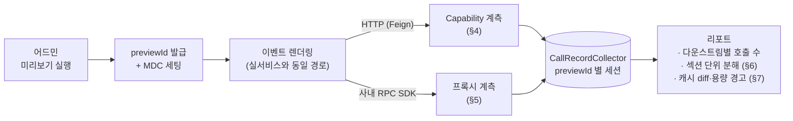
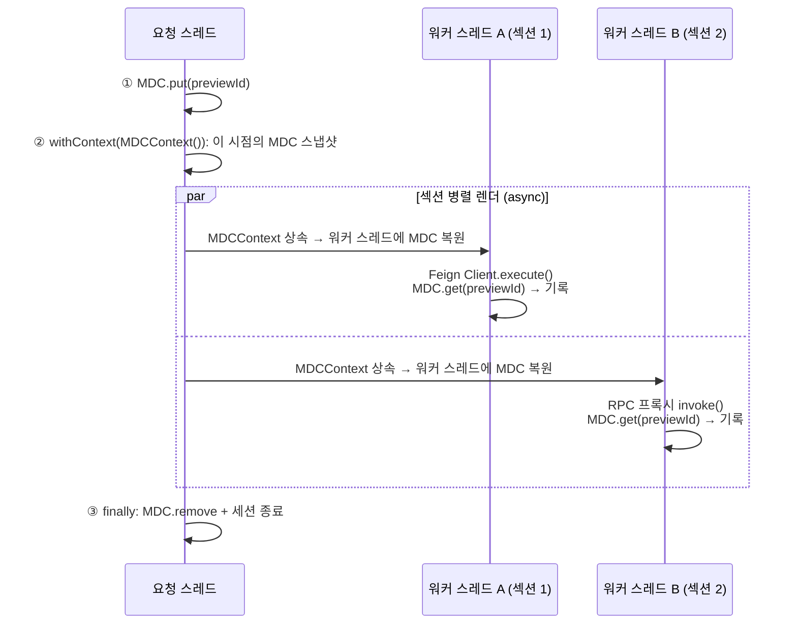
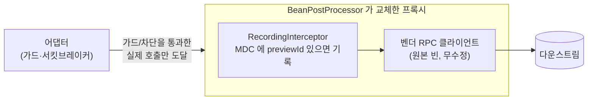

## 1. 어떤 문제를 풀려고 했나

우리 팀은 운영자가 어드민에서 섹션(쿠폰 목록, 배너, 전시 상품 등)을 조합해 이벤트 페이지를 만드는
플랫폼을 운영합니다. 사용자가 이벤트 페이지를 열면 서버는 섹션 구성에 따라 여러 외부
시스템(쿠폰, 광고, 전시, 회원 등)을 호출해 화면을 조립합니다.

문제는 이 **증폭(fan-out)의 크기가 이벤트마다 다르고, 오픈 전에는 알기 어렵다**는 점입니다.
요청 1건이 다운스트림 호출 몇 건이 되는지는 섹션을 몇 개 넣었는지, 섹션 안에 아이템을 몇 개
설정했는지, 캐시가 적중하는지, 회원인지 게스트인지에 따라 달라집니다. 예상보다 fan-out이 크면
오픈 직후 푸시 트래픽이 몰리는 순간 다운스트림 호출 제한(bulkhead)에 걸려 섹션이 비어 보이거나,
상대 시스템에 갑작스러운 부하를 줄 수 있습니다.

오픈 전에 "이 이벤트를 열면 쿠폰 시스템에 초당 몇 건이 나가는가"를 알고 싶었습니다.

## 2. 기존 접근법이 안 되는 이유

### 정적 분석: 엣지는 찾아도 배수는 못 구한다

코드를 훑어 HTTP 클라이언트 호출을 찾으면 "어떤 다운스트림을 호출할 수 있는가"는 알 수 있습니다.
하지만 "요청 1건당 몇 번"은 원리적으로 알 수 없습니다.

```kotlin
// 정적으로는 '엣지 1개'지만, 런타임에는 items.size 만큼 호출된다
items.forEach { item -> couponClient.getCoupon(item.couponId) }

// 실제 fan-out = 코드상 fan-out × 캐시 miss율. miss율은 런타임 값이다
cache.get(couponId) { couponClient.getCoupon(couponId) }
```

루프의 배수, 캐시 적중률, 조건 분기, 재시도 정책까지 전부 런타임에 결정됩니다. 실제로 정적
마이크로서비스 아키텍처 복원 도구들을 비교한 연구([arXiv:2412.08352](https://arxiv.org/abs/2412.08352))에서도
대부분의 도구가 엣지 존재 여부조차 정확히 못 맞혔고, 호출 횟수는 평가 대상도 아니었습니다.

### 런타임 관측: 트래픽이 흐른 뒤에만 존재한다

분산 트레이싱이나 메트릭으로 fan-out을 구하는 것은 업계 표준이고 정확합니다. 하지만 이 데이터는
**실제 트래픽이 흐른 뒤에야** 쌓입니다. 새로 만든 이벤트에는 트래픽이 없으므로, "오픈 전에 알고
싶다"는 요구에는 답할 수 없습니다.

### 남은 선택지: 리허설 1회를 실측하기

그래서 세 번째 길을 택했습니다. **오픈 전 이벤트를 실서비스와 동일한 코드 경로로 1회 렌더링하고,
그 1회 동안 나간 다운스트림 호출을 정확히 세는 것**입니다. 실제 코드가 실행되므로 루프 배수·캐시·
분기가 전부 반영된 실측값이 나오고, 트래픽은 필요 없습니다. 여기에 예상 유입 RPS를 곱하면
다운스트림별 예상 부하가 나옵니다.

전체 구조를 먼저 그려보면 이렇습니다.



요구사항은 세 가지로 정리됩니다.

1. 미리보기 실행이 유발한 호출**만** 정확히 세어야 한다 (같은 서버의 다른 트래픽과 섞이면 안 됨)
2. HTTP(Feign)든 사내 RPC SDK든 **모든 종류의 다운스트림**을 잡아야 한다
3. 계측이 일반 사용자 트래픽에 **영향을 주면 안 된다**

## 3. 요청 단위 귀속: 전역 메트릭 diff는 왜 안 되나

가장 먼저 떠오르는 방법은 Micrometer 카운터를 실행 전후로 snapshot해서 diff하는 것입니다.
간단하지만 치명적인 약점이 있습니다. **같은 JVM에서 동시에 실행되는 다른 요청, 캐시의 background
refresh가 만든 호출이 diff에 섞입니다.** "이 미리보기 실행이 유발한 호출"이라는 인과 관계를
전역 카운터는 표현할 수 없습니다.

그래서 실행마다 고유 ID(`previewId`)를 발급하고, 그 실행의 **호출 경로 전체에 ID를 전파**한 뒤,
계측 지점에서 ID를 읽어 기록을 귀속시키는 설계를 택했습니다. 전파 수단은 SLF4J **MDC**입니다.

### 왜 MDC인가

MDC(Mapped Diagnostic Context)는 스레드 로컬 기반의 key-value 저장소로, 원래 로그에 요청
컨텍스트를 싣기 위한 표준 도구입니다. 이를 전파 수단으로 쓴 이유는:

- **계측 지점(HTTP 클라이언트 내부)까지 파라미터를 뚫지 않아도 됩니다.** fan-out 측정을 위해
  서비스 레이어의 수십 개 메서드 시그니처에 `previewId`를 추가하는 것은 배보다 배꼽이 큽니다.
- **코루틴 전파가 이미 해결되어 있습니다.** `kotlinx-coroutines-slf4j`의 `MDCContext`가 코루틴
  경계에서 MDC를 복원해 줍니다. 우리 렌더 경로는 섹션들을 `async`로 병렬 처리하는데, 부모의
  `MDCContext`를 자식 코루틴이 상속하므로 워커 스레드가 바뀌어도 ID가 따라갑니다.
- **없으면 no-op으로 만들기 쉽습니다.** 계측 코드의 첫 줄이 `MDC.get() ?: return`이면, 일반
  트래픽의 오버헤드는 스레드 로컬 조회 1회(수십 ns)로 끝납니다.

previewId가 병렬 섹션 렌더링을 거쳐 계측 지점까지 도달하는 흐름은 다음과 같습니다.



단, 함정이 하나 있습니다. `MDCContext()`는 **생성 시점의 MDC를 스냅샷**합니다. 즉 ①과 ②의 순서가
바뀌면 자식 코루틴에 previewId가 전파되지 않는데, 예외도 없이 계측만 조용히 빠지기 때문에
알아차리기 어렵습니다. 우리는 이 제약을 헬퍼 함수 하나에 가두고 주석으로 못 박았습니다.

```kotlin
suspend fun <T> withPreviewId(previewId: String, block: suspend () -> T): T {
    MDC.put(PREVIEW_ID, previewId)              // 1. 먼저 MDC 에 넣고
    return try {
        withContext(MDCContext()) { block() }   // 2. 그 다음 스냅샷을 떠서 자식 코루틴에 전파
    } finally {
        MDC.remove(PREVIEW_ID)
    }
}
```

기록 저장소는 실행 ID별 세션 방식으로 만들었습니다. 핵심은 두 가지 방어 장치입니다:
`start()`로 세션을 연 ID만 기록을 받고(다른 경로에 MDC가 남아 흘러들어와도 무시), 종료 처리가
누락된 세션은 TTL로 청소합니다.

```kotlin
@Component
class CallRecordCollector {
    private val sessions = ConcurrentHashMap<String, Session>()

    fun start(id: String) { evictStale(); sessions[id] = Session() }
    fun record(id: String, record: CallRecord) { sessions[id]?.records?.add(record) }
    fun finish(id: String): List<CallRecord> = sessions.remove(id)?.records?.toList() ?: emptyList()
}
```

## 4. HTTP 호출 계측: Feign Capability

### Capability란

OpenFeign의 `Capability`는 Feign 클라이언트를 구성하는 컴포넌트들(`Client`, `Retryer`,
`Decoder` …)을 **빌드 시점에 데코레이트**할 수 있는 확장점입니다. spring-cloud-openfeign을 쓰면
컨텍스트에 등록된 `Capability` 빈이 모든 `@FeignClient`에 자동 적용됩니다. Micrometer 연동
(`MicrometerObservationCapability`)이 바로 이 메커니즘으로 동작합니다.

우리는 `Client`(실제 HTTP 전송을 담당하는 최하층 인터페이스)를 감쌌습니다.

```kotlin
@Component
class RecordingCapability(private val collector: CallRecordCollector) : Capability {
    override fun enrich(client: Client): Client = Client { request, options ->
        val previewId = MDC.get(PREVIEW_ID)
            ?: return@Client client.execute(request, options)   // 일반 트래픽은 즉시 통과

        val started = System.nanoTime()
        var status: Int? = null
        try {
            client.execute(request, options).also { status = it.status() }
        } finally {
            collector.record(previewId, CallRecord(
                client = request.requestTemplate().feignTarget().name(),
                // path variable 확장 전 URI 템플릿 → 값이 달라도 같은 집계 키로 묶인다
                endpoint = "${request.httpMethod()} ${request.requestTemplate().methodMetadata()?.template()?.path()}",
                isSuccess = status?.let { it < 400 } ?: false,  // 응답 자체를 못 받으면 실패
                durationMillis = (System.nanoTime() - started) / 1_000_000,
            ))
        }
    }
}
```

### 왜 인터셉터가 아니라 Client 래핑인가

계측 지점의 높이가 곧 측정의 의미를 결정합니다. `Client.execute()`는 **재시도를 포함해 wire 호출
시도마다** 불립니다. 즉 재시도로 부풀어난 호출도 그대로 집계됩니다(다운스트림 입장에서는 그것이
실제 부하입니다). 반대로 서킷브레이커가 열려 fallback으로 처리된 경우는 `execute()` 자체가 불리지
않으므로 집계에서 빠집니다. "코드가 호출하려 한 횟수"가 아니라 **"실제로 나간 호출"** 을 세는
것이 목적이므로, 이 지점이 정확히 맞습니다.

다른 후보들과 비교하면:

| 계측 지점 | 재시도 반영 | fallback 제외 | 응답 상태 | 판정 |
|---|---|---|---|---|
| 서비스/어댑터 AOP | ✗ (의도 횟수만) | ✗ | ✗ | 부정확 |
| Feign `RequestInterceptor` | ○ | ○ | ✗ (요청만 관여) | 아쉬움 |
| **Feign `Client` 래핑** | **○** | **○** | **○** | **채택** |

## 5. 비-HTTP RPC 계측: BeanPostProcessor 프록시

문제는 모든 다운스트림이 Feign을 쓰지 않는다는 것입니다. 사내 RPC SDK가 제공하는 클라이언트
객체(벤더 코드)를 그대로 주입받아 쓰는 경우, Capability 같은 확장점이 없습니다.

### 첫 번째 후보: 어댑터 메서드 AOP(기각)

각 어댑터(RPC 클라이언트를 감싸는 우리 쪽 클래스)의 메서드에 `@Around` 어스펙트를 걸면 될 것
같지만, 정확도가 무너지는 경우가 두 가지 있습니다.

```kotlin
@CircuitBreaker(name = "recommend-api", fallbackMethod = "fallback")
fun getRecommendations(userId: String, itemIds: List<Long>): Result {
    if (itemIds.isEmpty() || userId.isGuest()) {
        return Result.empty()        // (a) 조기 반환: 원격 호출 없음
    }
    return rpcClient.recommend(...)  // 실제 원격 호출은 여기서만
}
```

(a) 처럼 **가드에 걸려 원격 호출 없이 반환하는 경로**, 그리고 서킷브레이커가 열려 **fallback만
실행되는 경우**: 둘 다 실제 호출이 없는데 어댑터 메서드는 "호출된 것"으로 집계됩니다. 게다가
가드 안쪽만 별도 메서드로 뽑아 어노테이션을 붙이는 우회는 Spring AOP의 자기 호출(self-invocation)
한계에 걸립니다.

### 선택: 클라이언트 빈을 BeanPostProcessor로 감싸기

정확한 계측 지점은 어댑터가 아니라 **벤더 클라이언트 객체의 메서드 호출**입니다. 벤더 코드는
수정할 수 없지만, 그 객체가 Spring 빈이라는 점을 이용할 수 있습니다. `BeanPostProcessor`는 모든
빈의 초기화 직후에 개입해 **빈을 다른 객체(프록시)로 교체**할 수 있는 Spring의 확장점입니다.
트랜잭션(`@Transactional`)이나 resilience 어노테이션이 동작하는 원리와 같은 계열입니다.



```kotlin
@Component
class RpcRecordingBeanPostProcessor(
    private val collectorProvider: ObjectProvider<CallRecordCollector>,
) : BeanPostProcessor {

    override fun postProcessAfterInitialization(bean: Any, beanName: String): Any {
        val clientName = RPC_CLIENTS.entries.firstOrNull { it.key.isInstance(bean) }?.value
            ?: return bean                          // 계측 대상이 아니면 그대로

        return try {
            ProxyFactory(bean).apply {
                addAdvice(RecordingInterceptor(clientName, collectorProvider))
            }.proxy
        } catch (e: Exception) {
            log.warn(e) { "계측 프록시 생성 실패, 원본 빈으로 동작: $beanName" }
            bean                                    // 계측 실패가 기동을 막지 않도록
        }
    }

    companion object {
        private val RPC_CLIENTS: Map<Class<*>, String> = mapOf(
            RecommendServiceRemote::class.java to "recommend-api",
            StockServiceRemote::class.java to "stock-api",
        )
    }
}

private class RecordingInterceptor(
    private val clientName: String,
    private val collectorProvider: ObjectProvider<CallRecordCollector>,
) : MethodInterceptor {
    override fun invoke(invocation: MethodInvocation): Any? {
        if (invocation.method.declaringClass == Object::class.java) {
            return invocation.proceed()             // toString/hashCode 는 원격 호출이 아니다
        }
        val previewId = MDC.get(PREVIEW_ID) ?: return invocation.proceed()

        val started = System.nanoTime()
        var success = false
        try {
            return invocation.proceed().also { success = true }
        } finally {
            collectorProvider.getObject().record(previewId, CallRecord(
                client = clientName,
                endpoint = "${invocation.method.declaringClass.simpleName}#${invocation.method.name}",
                isSuccess = success,                // RPC 는 HTTP 상태가 없으니 예외 여부로 판정
                durationMillis = (System.nanoTime() - started) / 1_000_000,
            ))
        }
    }
}
```

이 방식이 좋은 이유:

- **의미론이 Feign 계측과 일치합니다.** 어댑터의 가드·fallback을 지나 실제로 원격 객체의 메서드가
  불릴 때만 기록됩니다. resilience 어노테이션(AOP)은 어댑터 바깥에서 동작하므로 순서 충돌도 없습니다.
- **벤더 코드 무수정.** SDK가 인터페이스면 JDK 프록시, 콘크리트 클래스면 CGLIB. Spring
  `ProxyFactory`가 알아서 선택합니다. 프록시 생성이 불가능한 클래스(final 등)를 만나면 경고만
  남기고 원본을 반환해, 계측 기능이 애플리케이션 기동을 인질로 잡지 않게 했습니다.
- **오버헤드는 프록시 홉 1회 + MDC 조회 1회.** 네트워크 지연(ms) 대비 무시 가능한 수준입니다.

디테일 두 가지를 덧붙이면, `ObjectProvider`로 collector를 지연 주입한 것은 BeanPostProcessor가
컨테이너에서 매우 이른 시점에 만들어지기 때문이고("bean is not eligible for post-processing" 경고
회피), `Object` 메서드를 걸러낸 것은 로그 출력이나 컬렉션 연산이 부른 `toString()` 따위가
원격 호출로 집계되는 것을 막기 위해서입니다.

## 6. 한 걸음 더: 어느 섹션이 문제인지까지

전체 fan-out을 알면 다음 질문은 "그래서 어느 섹션 때문인데?"입니다. 답은 MDC 키 하나를 더 얹는
것으로 해결됩니다. 섹션을 병렬 렌더링하는 `async` 블록에서, **미리보기 실행 중일 때만** 섹션 ID를
MDC에 넣습니다.

```kotlin
private fun <T> attributingSection(sectionId: Long, block: () -> T): T {
    if (MDC.get(PREVIEW_ID) == null) return block()   // 일반 트래픽은 MDC 를 건드리지 않는다

    MDC.put(SECTION_ID, sectionId.toString())
    return try { block() } finally { MDC.remove(SECTION_ID) }
}
```

계측 지점(Capability, RPC 인터셉터)은 기록 시점에 이 키를 함께 읽어 저장하고, 리포트는 섹션
단위로 분해됩니다. "이 이벤트 fan-out의 80%는 전시 섹션의 N+1 호출"처럼, 측정이 곧바로 구성
조정이나 코드 개선으로 이어질 수 있는 형태가 됩니다.

섹션들은 서로 다른 스레드에서 병렬로 돌지만, MDC는 스레드 로컬이므로 섹션 간 오염이 없습니다.

## 7. 측정값을 판단으로: 캐시 diff와 Little's law

숫자를 나열하는 리포트와 "위험하다/괜찮다"를 말해주는 리포트는 쓸모가 다릅니다. 실측값을 판단으로
바꾸기 위해 두 가지를 더했습니다.

### 콜드/웜 두 번 실행

렌더 경로에 로컬 캐시(Caffeine)가 있다면 실행 시점의 캐시 상태가 결과를 좌우합니다. 우리는
Caffeine의 `stats()`를 실행 전후로 snapshot해 diff를 리포트에 포함하고, **두 번 실행**을
권장합니다. 첫 실행(콜드)은 오픈 직후 스파이크의 상한을, 두 번째(웜)는 평상시 수치를 의미합니다.
같은 기능으로 두 가지 질문에 답하는 셈입니다.

### 예상 동시 호출 수와 bulkhead 대조

측정된 "요청 1건당 호출 수"에 예상 유입 RPS를 곱하면 다운스트림별 예상 RPS가 나옵니다. 그런데
호출 제한(bulkhead)은 보통 RPS가 아니라 **동시 실행 수**로 걸려 있습니다. 둘을 잇는 다리가
**Little's law**입니다: 평균 동시 실행 수 = 도착률 × 평균 체류 시간.

```
예상 동시 호출 수 ≈ (호출 수/요청 × 예상 RPS) × 평균 응답시간(초)
```

예를 들어 미리보기에서 "요청 1건당 쿠폰 시스템 12콜, 평균 35ms"가 측정됐고 오픈 시 유입을
50 RPS로 예상한다면, 예상 동시 호출 수는 12 × 50 × 0.035 ≈ **21**입니다. bulkhead가 30이라면
사용률 70%로 통과, 20이라면 105%로 경고입니다. 평균 응답시간도 미리보기 실행에서 이미 실측되어
있으므로 추가 입력은 예상 RPS 하나뿐입니다. "쿠폰 시스템 예상 사용률 105%: 오픈 시 섹션이 비어
보일 수 있음"처럼, 숫자가 아니라 판단을 돌려주는 것이 목표였습니다.

## 8. 정직한 한계

- **미리보기도 실제 호출입니다.** 조회성 호출뿐이지만 다운스트림 입장에선 실트래픽입니다.
  사람이 버튼을 누르는 빈도라 문제없는 수준이지만, 리포트에 명시합니다.
- **렌더 이후의 트래픽은 못 잽니다.** 쿠폰 발급, 매장 상세 조회처럼 사용자 행동으로 발생하는
  후속 호출은 "화면당 몇 번"이 아니라 전환율의 문제라, 측정 대신 리포트에 미계측 목록으로
  명시하고 과거 이벤트의 전환율로 별도 추정합니다.
- **저부하 측정은 고부하를 과소평가할 수 있습니다.** 재시도 폭증은 시스템이 포화될 때 나타나는데,
  미리보기 1회는 그 상태를 재현하지 않습니다.
- **RPC 계측 대상은 수동 등록입니다.** 새 RPC 클라이언트가 추가되면 매핑에 등록해야 합니다.
  코드 리뷰 체크리스트로 관리하고 있습니다.

## 9. 정리

| 문제 | 선택한 기술 | 선택한 이유 |
|---|---|---|
| 실행 단위 귀속 | MDC + `MDCContext` | 시그니처 오염 없이 코루틴 경계 전파, 없으면 no-op |
| HTTP 호출 계측 | Feign `Capability` (`Client` 래핑) | 재시도 포함·fallback 제외, "실제 나간 호출"과 의미 일치 |
| RPC 호출 계측 | `BeanPostProcessor` + 프록시 | 벤더 코드 무수정, 가드·fallback 을 자연히 제외 |
| 섹션 귀속 | MDC 키 중첩 | 측정을 "어느 구성요소 때문인지"라는 답으로 연결 |
| 용량 판단 | 캐시 stats diff + Little's law | 실측만으로 bulkhead 대비 경고까지 자동화 |

돌아보면 이 작업의 핵심은 특정 기술이 아니라 **계측 지점의 높이를 목적에 맞추는 일**이었습니다.
"코드가 호출하려 한 횟수"가 아니라 "실제로 나간 호출"을 세기로 정의를 먼저 내리고 나니, Feign은
`Client`를, RPC는 벤더 빈을 감싸야 한다는 결론이 자연스럽게 따라왔습니다. 정적 분석으로는 원리적으로
알 수 없고 사후 관측으로는 너무 늦는 값도, "실서비스 경로로 리허설 1회"라는 프레임을 찾으면
의외로 적은 코드로 정확하게 잴 수 있습니다.

---

*이 글은 AI의 도움을 받아 교정 및 정리되었습니다.*
